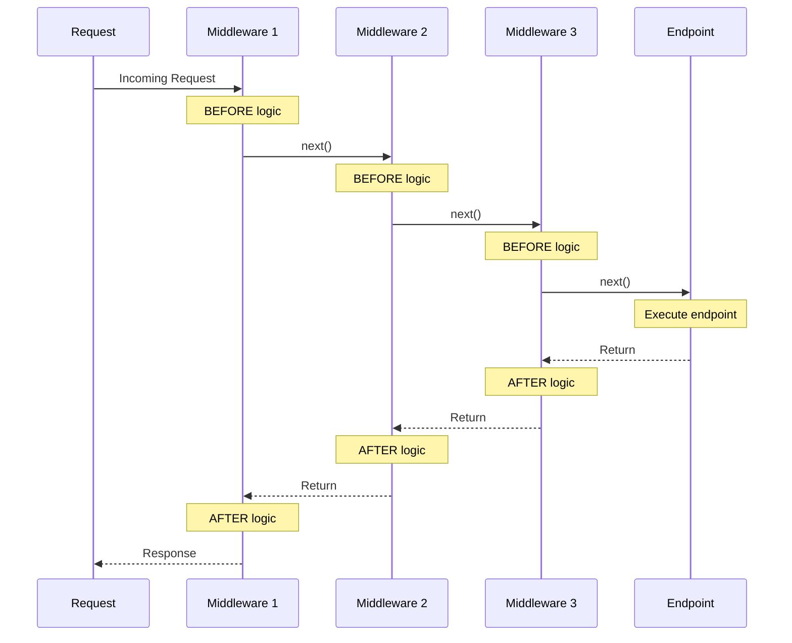
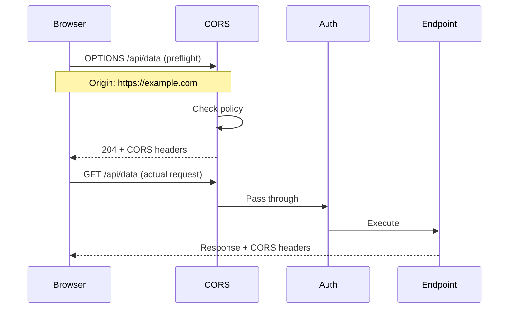
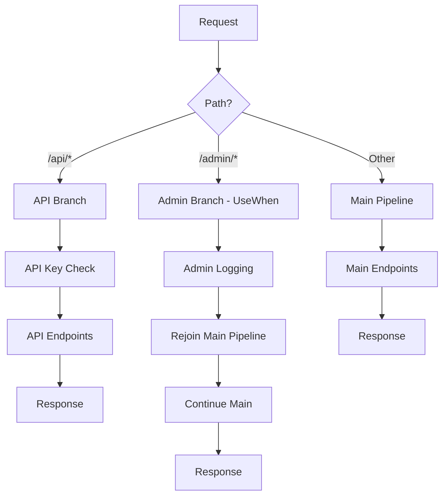

# Understanding the ASP.NET Core Pipeline - Part 3: Middleware (The Stuff That Actually Does Things)

<!--category-- ASP.NET Core, C#, Middleware, CORS, Authentication -->
<datetime class="hidden">2024-11-08T02:00</datetime>

> **AI GENERATED** - If that offends you, please stop reading.

# Introduction

If the host is WHERE your app runs and Kestrel is HOW it receives requests, middleware is WHAT ACTUALLY HAPPENS to those requests.

Middleware is where 99% of web application logic lives. Authentication? Middleware. CORS? Middleware. Static files? Middleware. Exception handling? You guessed it - middleware.

The thing is, ORDER MATTERS. Get your middleware in the wrong order and you'll spend hours debugging why your authentication isn't working or why CORS is rejecting requests that should work.

I've seen production apps with middleware ordered so badly that security was effectively disabled. Don't be that developer.

[TOC]

# The Problem with Middleware

Most developers treat middleware like this:

```csharp
app.UseSomething();
app.UseSomethingElse();
app.UseAnotherThing();
```

Copy-paste from StackOverflow, hope for the best. Until it doesn't work.

The issues I see:
- Authentication middleware AFTER endpoints (so it never runs)
- CORS middleware AFTER authorization (so CORS never applies)
- Exception handler LAST (so it catches nothing)
- Custom logging middleware that writes to disk on EVERY request in production (RIP your disk I/O)

**MIDDLEWARE IS JUST A CHAIN OF FUNCTIONS - UNDERSTAND THE CHAIN**

# How Middleware ACTUALLY Works

Here's the mental model you need:



Each middleware can:
1. Do stuff BEFORE calling next middleware
2. Call next middleware (or NOT - that's short-circuiting)
3. Do stuff AFTER next middleware returns

Think of it like Russian dolls - each middleware wraps the next one.

```csharp
// Middleware 1
app.Use(async (context, next) =>
{
    Console.WriteLine("1: Before");
    await next(context);  // Call middleware 2
    Console.WriteLine("1: After");
});

// Middleware 2
app.Use(async (context, next) =>
{
    Console.WriteLine("2: Before");
    await next(context);  // Call middleware 3
    Console.WriteLine("2: After");
});

// Middleware 3 (endpoint)
app.Run(async context =>
{
    Console.WriteLine("3: Endpoint");
    await context.Response.WriteAsync("Hello");
});

// Output:
// 1: Before
// 2: Before
// 3: Endpoint
// 2: After
// 1: After
```

Simple, right? Except order REALLY matters.

# The Correct Order (Do NOT Mess This Up)

Here's the order you SHOULD use. I'm being prescriptive here because I've debugged too many apps where people got creative:

```csharp
var builder = WebApplication.CreateBuilder(args);
var app = builder.Build();

// 1. Exception handler (FIRST - catches everything)
app.UseExceptionHandler("/error");

// 2. HSTS (if using HTTPS)
if (!app.Environment.IsDevelopment())
{
    app.UseHsts();
}

// 3. HTTPS redirection
app.UseHttpsRedirection();

// 4. Static files (can short-circuit early)
app.UseStaticFiles();

// 5. Routing (matches endpoint, doesn't execute)
app.UseRouting();

// 6. CORS (after routing, before auth)
app.UseCors();

// 7. Authentication (WHO are you?)
app.UseAuthentication();

// 8. Authorization (WHAT can you do?)
app.UseAuthorization();

// 9. Custom middleware here
app.UseMiddleware<RequestTimingMiddleware>();

// 10. Endpoints (LAST - actually executes your code)
app.MapControllers();

app.Run();
```

WHY this order:

**Exception handler first** = Catches ALL errors from downstream middleware
**HTTPS redirection early** = Don't process insecure requests
**Static files early** = Fast path for .css/.js files, no auth needed
**Routing before CORS** = CORS needs to know which endpoint was matched
**CORS before auth** = Preflight requests don't have auth headers
**Auth before authorization** = Need to know WHO before checking permissions
**Endpoints last** = Everything else runs first

Get this wrong and you're in for a bad time. I've seen:
- Auth after endpoints = everyone can access everything
- CORS after auth = preflight requests fail with 401
- Exception handler last = it catches nothing

# Built-In Middleware You'll Actually Use

## Exception Handler Middleware

```csharp
app.UseExceptionHandler(errorApp =>
{
    errorApp.Run(async context =>
    {
        var error = context.Features.Get<IExceptionHandlerFeature>();

        context.Response.StatusCode = 500;
        context.Response.ContentType = "application/json";

        await context.Response.WriteAsJsonAsync(new
        {
            error = error?.Error.Message,
            // Only in dev - don't leak stack traces in production
            stackTrace = app.Environment.IsDevelopment()
                ? error?.Error.StackTrace
                : null
        });
    });
});
```

*NOTE: Don't send detailed error messages to users in production. Log them, sure. But don't send them to the client.*

## Static Files - The Performance Win

Static files middleware can short-circuit the ENTIRE pipeline:

```csharp
// Basic - serves from wwwroot/
app.UseStaticFiles();

// Custom location
app.UseStaticFiles(new StaticFileOptions
{
    FileProvider = new PhysicalFileProvider(
        Path.Combine(builder.Environment.ContentRootPath, "MyStaticFiles")),
    RequestPath = "/static"
});

// With caching headers (for production)
app.UseStaticFiles(new StaticFileOptions
{
    OnPrepareResponse = ctx =>
    {
        // Cache static files for 1 year
        ctx.Context.Response.Headers.Append(
            "Cache-Control", "public,max-age=31536000");
    }
});
```

WHY this matters: If `/logo.png` is requested, static files middleware serves it and returns IMMEDIATELY. No routing, no auth, no endpoint execution. Massive performance win.

## Authentication Middleware

```csharp
builder.Services.AddAuthentication("Bearer")
    .AddJwtBearer("Bearer", options =>
    {
        options.TokenValidationParameters = new TokenValidationParameters
        {
            ValidateIssuer = true,
            ValidIssuer = "https://yourapp.com",
            ValidateAudience = true,
            ValidAudience = "https://yourapp.com",
            ValidateLifetime = true,
            ValidateIssuerSigningKey = true,
            IssuerSigningKey = new SymmetricSecurityKey(
                Encoding.UTF8.GetBytes(builder.Configuration["Jwt:Secret"]))
        };
    });

var app = builder.Build();

app.UseAuthentication(); // Sets context.User if token is valid
app.UseAuthorization();  // Checks if context.User can access endpoint
```

Authentication just sets `context.User`. Authorization is what actually blocks requests.

## CORS - Get This Right or APIs Don't Work

CORS is confusing. Here's the deal:

```csharp
builder.Services.AddCors(options =>
{
    // Dev: Allow everything (don't use in production!)
    options.AddPolicy("AllowAll", policy =>
    {
        policy.AllowAnyOrigin()
              .AllowAnyMethod()
              .AllowAnyHeader();
    });

    // Production: Be specific
    options.AddPolicy("Production", policy =>
    {
        policy.WithOrigins("https://yourfrontend.com")
              .WithMethods("GET", "POST", "PUT", "DELETE")
              .WithHeaders("Content-Type", "Authorization")
              .AllowCredentials(); // Needed for cookies/auth
    });
});

var app = builder.Build();

app.UseRouting();

// CORS after routing, before auth
if (app.Environment.IsDevelopment())
{
    app.UseCors("AllowAll");
}
else
{
    app.UseCors("Production");
}

app.UseAuthentication();
app.UseAuthorization();
```

CORS preflight (OPTIONS) requests happen BEFORE your endpoint. The browser sends OPTIONS, middleware responds, then the real request happens.



If you put CORS after auth, preflight requests (which don't have auth headers) will fail with 401.

## Response Caching - Free Performance

```csharp
builder.Services.AddResponseCaching();

var app = builder.Build();

app.UseResponseCaching();

app.MapGet("/cached", (HttpContext context) =>
{
    // Cache for 60 seconds
    context.Response.Headers.CacheControl = "public,max-age=60";

    return new
    {
        timestamp = DateTime.UtcNow,
        data = "This will be cached"
    };
});

app.MapGet("/no-cache", (HttpContext context) =>
{
    context.Response.Headers.CacheControl = "no-cache";

    return new
    {
        timestamp = DateTime.UtcNow,
        data = "Fresh every time"
    };
});
```

First request: Generates response and caches it.
Subsequent requests (within 60s): Served from cache, your endpoint NEVER runs.

Free performance. USE IT.

## Response Compression - Bandwidth Savings

```csharp
builder.Services.AddResponseCompression(options =>
{
    options.EnableForHttps = true; // BE CAREFUL with this (BREACH/CRIME attacks)

    options.Providers.Add<BrotliCompressionProvider>();
    options.Providers.Add<GzipCompressionProvider>();

    options.MimeTypes = ResponseCompressionDefaults.MimeTypes.Concat(
        new[] { "application/json" });
});

var app = builder.Build();

app.UseResponseCompression();
```

Compresses responses automatically. Can reduce payload size by 70%+.

*NOTE: Compression + HTTPS can be vulnerable to CRIME/BREACH attacks if you're not careful. Don't compress user secrets mixed with attacker-controlled input.*

# Writing Custom Middleware

Three ways to do it:

## 1. Inline (Quick and Dirty)

```csharp
app.Use(async (context, next) =>
{
    var sw = Stopwatch.StartNew();

    await next(context);

    Console.WriteLine($"{context.Request.Path}: {sw.ElapsedMilliseconds}ms");
});
```

Fine for simple stuff. But for anything complex, use a class.

## 2. Class-Based (The Right Way)

```csharp
public class RequestTimingMiddleware
{
    private readonly RequestDelegate _next;
    private readonly ILogger<RequestTimingMiddleware> _logger;

    public RequestTimingMiddleware(
        RequestDelegate next,
        ILogger<RequestTimingMiddleware> logger)
    {
        _next = next;
        _logger = logger; // Singleton services only
    }

    public async Task InvokeAsync(
        HttpContext context,
        IMyService myService) // Scoped services here
    {
        var sw = Stopwatch.StartNew();

        try
        {
            await _next(context);
        }
        finally
        {
            sw.Stop();
            _logger.LogInformation(
                "{Method} {Path} completed in {Elapsed}ms with {StatusCode}",
                context.Request.Method,
                context.Request.Path,
                sw.ElapsedMilliseconds,
                context.Response.StatusCode);
        }
    }
}

// Extension method for convenience
public static class RequestTimingMiddlewareExtensions
{
    public static IApplicationBuilder UseRequestTiming(this IApplicationBuilder app)
    {
        return app.UseMiddleware<RequestTimingMiddleware>();
    }
}

// Usage
app.UseRequestTiming();
```

Singleton services in constructor, scoped services in InvokeAsync. This is the pattern.

## 3. IMiddleware (Factory-Based)

```csharp
public class ApiKeyMiddleware : IMiddleware
{
    private readonly ILogger<ApiKeyMiddleware> _logger;

    // Can inject scoped services in constructor
    public ApiKeyMiddleware(ILogger<ApiKeyMiddleware> logger)
    {
        _logger = logger;
    }

    public async Task InvokeAsync(HttpContext context, RequestDelegate next)
    {
        if (context.Request.Path.StartsWithSegments("/api"))
        {
            var apiKey = context.Request.Headers["X-API-Key"].FirstOrDefault();

            if (string.IsNullOrEmpty(apiKey))
            {
                context.Response.StatusCode = 401;
                await context.Response.WriteAsync("API Key required");
                return; // Short-circuit
            }

            // Validate API key here
        }

        await next(context);
    }
}

// Register as scoped
builder.Services.AddScoped<ApiKeyMiddleware>();

// Use it
app.UseMiddleware<ApiKeyMiddleware>();
```

# Real-World Middleware Examples

## Rate Limiting

```csharp
public class RateLimitingMiddleware
{
    private readonly RequestDelegate _next;
    private readonly IMemoryCache _cache;
    private const int RequestLimit = 100;
    private static readonly TimeSpan TimeWindow = TimeSpan.FromMinutes(1);

    public RateLimitingMiddleware(RequestDelegate next, IMemoryCache cache)
    {
        _next = next;
        _cache = cache;
    }

    public async Task InvokeAsync(HttpContext context)
    {
        var clientIp = context.Connection.RemoteIpAddress?.ToString() ?? "unknown";
        var cacheKey = $"RateLimit_{clientIp}";

        var requestCount = _cache.GetOrCreate(cacheKey, entry =>
        {
            entry.AbsoluteExpirationRelativeToNow = TimeWindow;
            return 0;
        });

        if (requestCount >= RequestLimit)
        {
            context.Response.StatusCode = 429;
            context.Response.Headers["Retry-After"] = TimeWindow.TotalSeconds.ToString();
            await context.Response.WriteAsync("Rate limit exceeded");
            return;
        }

        _cache.Set(cacheKey, requestCount + 1, TimeWindow);

        await _next(context);
    }
}
```

This is basic rate limiting. For production, use a proper library like `AspNetCoreRateLimit`.

## Request ID for Tracing

```csharp
public class RequestIdMiddleware
{
    private readonly RequestDelegate _next;

    public RequestIdMiddleware(RequestDelegate next)
    {
        _next = next;
    }

    public async Task InvokeAsync(HttpContext context)
    {
        var requestId = context.Request.Headers["X-Request-ID"].FirstOrDefault()
                       ?? Guid.NewGuid().ToString();

        context.Response.Headers["X-Request-ID"] = requestId;
        context.Items["RequestId"] = requestId;

        await _next(context);
    }
}
```

Now every log can include the request ID. Makes debugging MUCH easier.

## Security Headers

```csharp
public class SecurityHeadersMiddleware
{
    private readonly RequestDelegate _next;

    public SecurityHeadersMiddleware(RequestDelegate next)
    {
        _next = next;
    }

    public async Task InvokeAsync(HttpContext context)
    {
        context.Response.Headers["X-Content-Type-Options"] = "nosniff";
        context.Response.Headers["X-Frame-Options"] = "DENY";
        context.Response.Headers["X-XSS-Protection"] = "1; mode=block";
        context.Response.Headers["Referrer-Policy"] = "strict-origin-when-cross-origin";

        // CSP - adjust for your needs
        context.Response.Headers["Content-Security-Policy"] =
            "default-src 'self'; script-src 'self'; style-src 'self'";

        await _next(context);
    }
}
```

Security headers are NON-NEGOTIABLE for production web apps.

# Middleware Branching

Sometimes you want different middleware for different paths:

```csharp
// Map creates a branch
app.Map("/api", apiApp =>
{
    apiApp.UseMiddleware<ApiKeyMiddleware>();
    apiApp.MapControllers();
});

// MapWhen creates a conditional branch
app.MapWhen(
    context => context.Request.Headers.ContainsKey("X-Custom-Header"),
    customApp =>
    {
        customApp.Use(async (context, next) =>
        {
            context.Response.Headers["X-Custom-Response"] = "Matched";
            await next(context);
        });
    });

// UseWhen branches but REJOINS main pipeline
app.UseWhen(
    context => context.Request.Path.StartsWithSegments("/admin"),
    adminApp =>
    {
        adminApp.Use(async (context, next) =>
        {
            // Log admin access
            await next(context);
        });
    });
```



# Common Mistakes

## Mistake 1: Forgetting await

```csharp
app.Use(async (context, next) =>
{
    next(context); // FORGOT await - EVERYTHING BREAKS
});
```

ALWAYS `await next(context)`. Otherwise your middleware continues while the next one is still running. Chaos.

## Mistake 2: Modifying Response After It Started

```csharp
app.Use(async (context, next) =>
{
    await next(context);

    // Response already sent - this FAILS
    context.Response.StatusCode = 500; // BOOM
});
```

Check `context.Response.HasStarted` before modifying headers/status code.

## Mistake 3: Wrong Order

```csharp
app.MapControllers();
app.UseAuthentication(); // TOO LATE
```

Auth MUST come before endpoints. Otherwise endpoints execute without auth.

## Mistake 4: Logging Everything in Production

```csharp
app.Use(async (context, next) =>
{
    // Don't do this for EVERY request in production
    await File.AppendAllTextAsync("log.txt", context.Request.Path);
    await next(context);
});
```

This will KILL your I/O performance. Use structured logging (Serilog) with appropriate log levels.

# In Conclusion

Middleware is the core of request processing in ASP.NET Core. It's not complicated - it's just a chain of functions.

Key points:
1. **Order matters** - Exception handler first, endpoints last
2. **Short-circuiting is normal** - Static files, rate limiting, etc.
3. **Response flows backward** - Each middleware sees it on the way out
4. **Don't modify response after it started** - Check HasStarted
5. **ALWAYS await next()** - Or you'll have a really bad day
6. **Use class-based middleware** - For anything beyond trivial logic

In Part 4 we'll cover routing - how requests actually match to your endpoints.

Now go fix your middleware order before it bites you in production!
