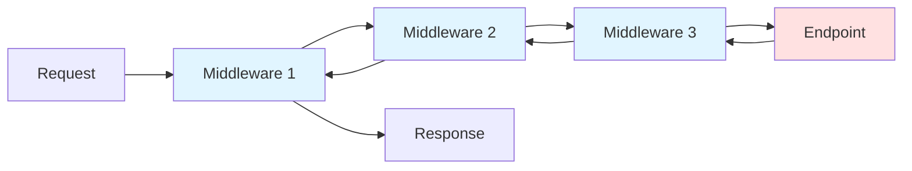
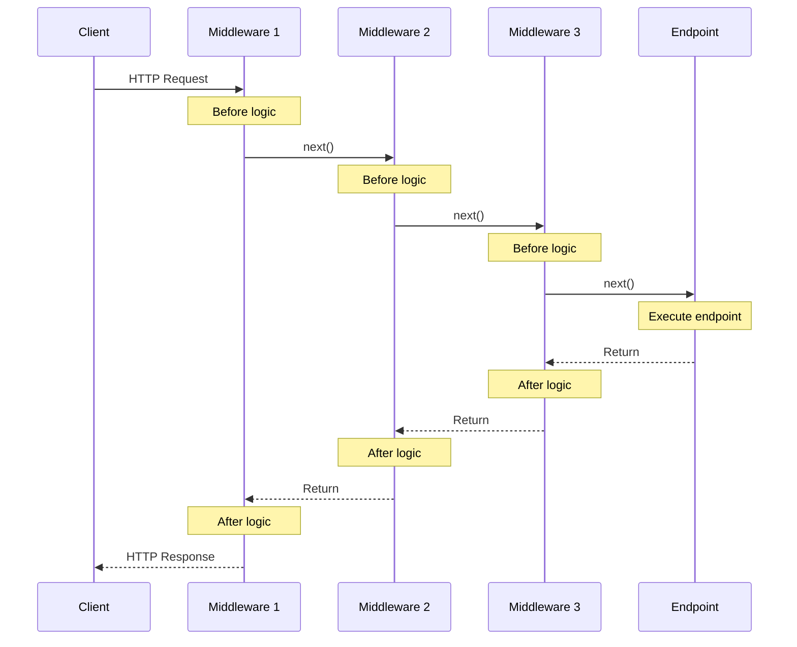
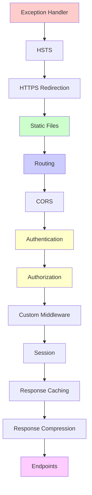
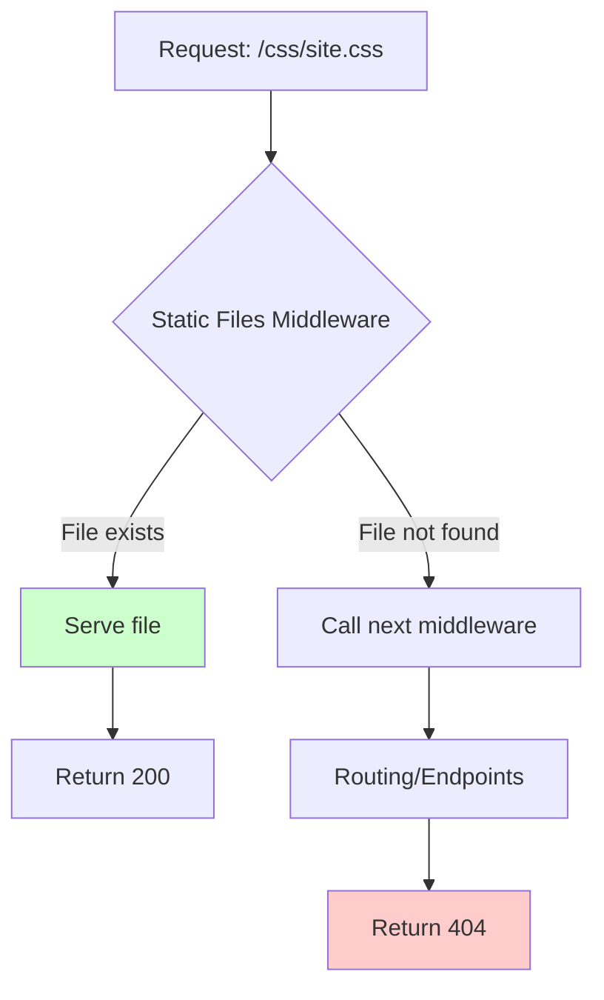
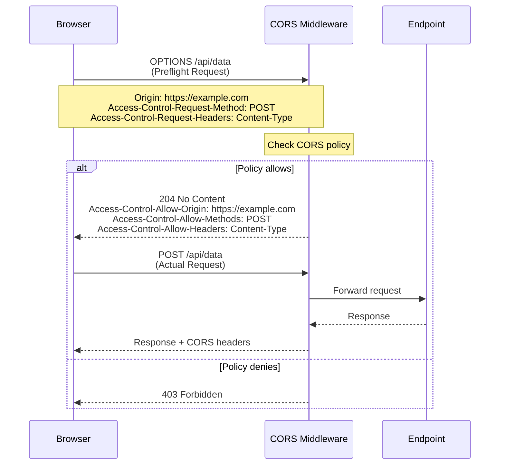
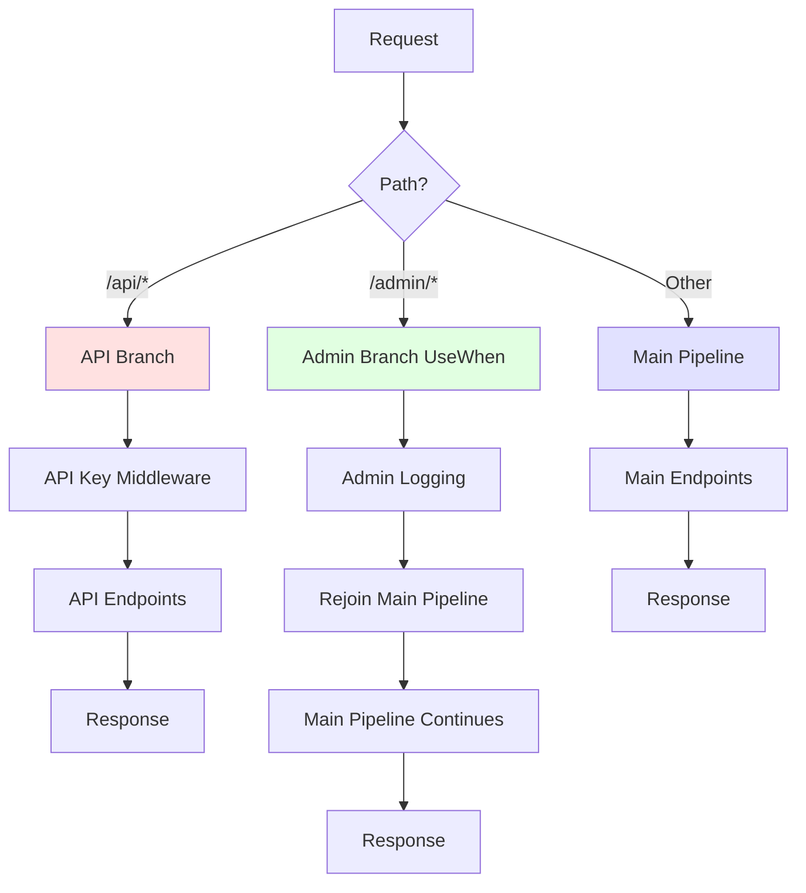

# Understanding the ASP.NET Core Request and Response Pipeline - Part 3: Middleware Pipeline

## Introduction

We've explored the hosting layer and Kestrel server in Part 2. Now we arrive at the heart of ASP.NET Core: the middleware pipeline. This is where your application's logic lives, where requests are processed, and where responses are built. Understanding middleware is fundamental to mastering ASP.NET Core.

Middleware is elegantly simple in concept—each component is a function that processes an HTTP request—yet powerful enough to handle everything from authentication to error handling to serving files. In this part, we'll explore how middleware works, examine the built-in components, and learn to create our own.

## What is Middleware?

Middleware is software that's assembled into an application pipeline to handle requests and responses. Each component:

1. **Chooses** whether to pass the request to the next component in the pipeline
2. **Can perform work** before and after the next component in the pipeline

Think of it as a series of nested function calls, where each middleware wraps the next one:



Each middleware can:
- Process the request before passing it to the next middleware
- Short-circuit and return a response immediately
- Process the response as it returns through the pipeline

## The Middleware Delegate Signature

At its core, middleware is just a function with this signature:

```csharp
public delegate Task RequestDelegate(HttpContext context);
```

Each middleware receives:
- `HttpContext context` - Contains all request and response information
- `RequestDelegate next` - The next middleware in the pipeline

## Middleware Execution Flow

Let's visualize how a request flows through middleware:



**Key Points:**
- Request flows forward through the pipeline (top to bottom)
- Response flows backward through the pipeline (bottom to top)
- Each middleware can execute code both before and after calling `next()`
- Middleware can short-circuit by not calling `next()`

## Creating Middleware: Three Approaches

### 1. Inline Middleware with `Use()`

The simplest approach uses lambda expressions:

```csharp
var builder = WebApplication.CreateBuilder(args);
var app = builder.Build();

app.Use(async (context, next) =>
{
    // Before the next middleware
    Console.WriteLine($"Request: {context.Request.Path}");
    var startTime = DateTime.UtcNow;

    // Call the next middleware
    await next(context);

    // After the next middleware
    var elapsed = DateTime.UtcNow - startTime;
    Console.WriteLine($"Response: {context.Response.StatusCode} ({elapsed.TotalMilliseconds}ms)");
});

app.MapGet("/", () => "Hello World!");

app.Run();
```

**Output when accessing `/`:**
```
Request: /
Response: 200 (15.3ms)
```

### 2. Terminal Middleware with `Run()`

`Run()` creates terminal middleware that ends the pipeline:

```csharp
var builder = WebApplication.CreateBuilder(args);
var app = builder.Build();

app.Use(async (context, next) =>
{
    Console.WriteLine("This executes");
    await next(context);
});

app.Run(async context =>
{
    Console.WriteLine("This is terminal - no next() to call");
    await context.Response.WriteAsync("End of pipeline");
});

// This never executes because Run() terminates the pipeline
app.Use(async (context, next) =>
{
    Console.WriteLine("This never executes");
    await next(context);
});

app.Run();
```

### 3. Class-Based Middleware

For complex middleware, use a class:

```csharp
// Middleware class
public class RequestTimingMiddleware
{
    private readonly RequestDelegate _next;
    private readonly ILogger<RequestTimingMiddleware> _logger;

    public RequestTimingMiddleware(RequestDelegate next, ILogger<RequestTimingMiddleware> logger)
    {
        _next = next;
        _logger = logger;
    }

    public async Task InvokeAsync(HttpContext context)
    {
        var sw = Stopwatch.StartNew();

        // Store start time in HttpContext.Items for other middleware to access
        context.Items["RequestStartTime"] = DateTime.UtcNow;

        try
        {
            await _next(context);
        }
        finally
        {
            sw.Stop();
            _logger.LogInformation(
                "Request {Method} {Path} completed in {ElapsedMs}ms with status {StatusCode}",
                context.Request.Method,
                context.Request.Path,
                sw.ElapsedMilliseconds,
                context.Response.StatusCode
            );
        }
    }
}

// Extension method for convenience
public static class RequestTimingMiddlewareExtensions
{
    public static IApplicationBuilder UseRequestTiming(this IApplicationBuilder builder)
    {
        return builder.UseMiddleware<RequestTimingMiddleware>();
    }
}

// Usage
var builder = WebApplication.CreateBuilder(args);
var app = builder.Build();

app.UseRequestTiming();

app.MapGet("/", () => "Hello World!");

app.Run();
```

**Output:**
```
info: RequestTimingMiddleware[0]
      Request GET / completed in 12ms with status 200
```

## Middleware Order Matters

The order in which you add middleware to the pipeline is critical. Here's the recommended order:



**Why this order?**

1. **Exception Handler** - Must be first to catch all exceptions
2. **HSTS** - Security header that should be set early
3. **HTTPS Redirection** - Redirect to HTTPS before processing
4. **Static Files** - Can short-circuit early for static content
5. **Routing** - Matches the request to an endpoint
6. **CORS** - Must be after Routing and before Authentication
7. **Authentication** - Identifies who the user is
8. **Authorization** - Determines what the user can do
9. **Custom Middleware** - Your application logic
10. **Session** - Session state management
11. **Response Caching** - Cache responses
12. **Response Compression** - Compress responses
13. **Endpoints** - Execute the matched endpoint

Let's see this in code:

```csharp
var builder = WebApplication.CreateBuilder(args);

// Add services
builder.Services.AddAuthentication();
builder.Services.AddAuthorization();
builder.Services.AddResponseCaching();
builder.Services.AddResponseCompression();
builder.Services.AddSession();
builder.Services.AddCors();

var app = builder.Build();

// 1. Exception handling (must be first)
if (app.Environment.IsDevelopment())
{
    app.UseDeveloperExceptionPage();
}
else
{
    app.UseExceptionHandler("/error");
    app.UseHsts(); // HTTP Strict Transport Security
}

// 2. HTTPS redirection
app.UseHttpsRedirection();

// 3. Static files (can short-circuit)
app.UseStaticFiles();

// 4. Routing (matches endpoints)
app.UseRouting();

// 5. CORS (after routing, before auth)
app.UseCors();

// 6. Authentication (who are you?)
app.UseAuthentication();

// 7. Authorization (what can you do?)
app.UseAuthorization();

// 8. Custom middleware
app.UseRequestTiming();

// 9. Session
app.UseSession();

// 10. Response caching
app.UseResponseCaching();

// 11. Response compression
app.UseResponseCompression();

// 12. Endpoints
app.MapGet("/", () => "Hello World!");

app.Run();
```

## Built-in Middleware Deep Dive

### Exception Handler Middleware

Catches exceptions from later middleware and generates error responses:

```csharp
var builder = WebApplication.CreateBuilder(args);
var app = builder.Build();

// Global exception handler
app.UseExceptionHandler(errorApp =>
{
    errorApp.Run(async context =>
    {
        context.Response.StatusCode = 500;
        context.Response.ContentType = "application/json";

        var error = context.Features.Get<IExceptionHandlerFeature>();
        if (error != null)
        {
            var ex = error.Error;

            await context.Response.WriteAsJsonAsync(new
            {
                error = new
                {
                    message = ex.Message,
                    type = ex.GetType().Name,
                    stackTrace = app.Environment.IsDevelopment() ? ex.StackTrace : null
                }
            });
        }
    });
});

// This will be caught by the exception handler
app.MapGet("/error", () =>
{
    throw new InvalidOperationException("Something went wrong!");
});

app.MapGet("/", () => "Hello World!");

app.Run();
```

**Testing:**
```bash
$ curl http://localhost:5000/error
{
  "error": {
    "message": "Something went wrong!",
    "type": "InvalidOperationException",
    "stackTrace": "..."
  }
}
```

### Static Files Middleware

Serves static files and short-circuits the pipeline:

```csharp
var builder = WebApplication.CreateBuilder(args);
var app = builder.Build();

// Default: serves files from wwwroot/
app.UseStaticFiles();

// Serve files from additional directory
app.UseStaticFiles(new StaticFileOptions
{
    FileProvider = new PhysicalFileProvider(
        Path.Combine(builder.Environment.ContentRootPath, "MyStaticFiles")),
    RequestPath = "/StaticFiles"
});

// Custom file type (MIME mapping)
var provider = new FileExtensionContentTypeProvider();
provider.Mappings[".myapp"] = "application/x-myapp";

app.UseStaticFiles(new StaticFileOptions
{
    ContentTypeProvider = provider
});

// Enable directory browsing (development only!)
if (app.Environment.IsDevelopment())
{
    app.UseDirectoryBrowser(new DirectoryBrowserOptions
    {
        FileProvider = new PhysicalFileProvider(
            Path.Combine(builder.Environment.ContentRootPath, "wwwroot")),
        RequestPath = "/browse"
    });
}

app.Run();
```

**Flow diagram:**



### Authentication Middleware

Authenticates the user based on the request:

```csharp
var builder = WebApplication.CreateBuilder(args);

// Add authentication services
builder.Services.AddAuthentication("Cookies")
    .AddCookie("Cookies", options =>
    {
        options.LoginPath = "/login";
        options.LogoutPath = "/logout";
        options.ExpireTimeSpan = TimeSpan.FromHours(1);
    })
    .AddJwtBearer("Bearer", options =>
    {
        options.TokenValidationParameters = new TokenValidationParameters
        {
            ValidateIssuer = true,
            ValidateAudience = true,
            ValidateLifetime = true,
            ValidateIssuerSigningKey = true,
            ValidIssuer = "https://myapp.com",
            ValidAudience = "https://myapp.com",
            IssuerSigningKey = new SymmetricSecurityKey(
                Encoding.UTF8.GetBytes("your-secret-key-here"))
        };
    });

var app = builder.Build();

app.UseAuthentication(); // Must be before UseAuthorization()

app.MapGet("/public", () => "Anyone can access this");

app.MapGet("/protected", () => "Only authenticated users can access this")
    .RequireAuthorization();

app.MapGet("/login", async (HttpContext context) =>
{
    var claims = new[]
    {
        new Claim(ClaimTypes.Name, "testuser"),
        new Claim(ClaimTypes.Email, "test@example.com")
    };

    var identity = new ClaimsIdentity(claims, "Cookies");
    var principal = new ClaimsPrincipal(identity);

    await context.SignInAsync("Cookies", principal);

    return Results.Ok("Logged in");
});

app.Run();
```

### Authorization Middleware

Determines if an authenticated user has permission to access a resource:

```csharp
var builder = WebApplication.CreateBuilder(args);

builder.Services.AddAuthentication("Cookies")
    .AddCookie("Cookies");

// Configure authorization policies
builder.Services.AddAuthorization(options =>
{
    // Policy: Requires specific claim
    options.AddPolicy("AdminOnly", policy =>
        policy.RequireClaim("role", "admin"));

    // Policy: Requires age over 18
    options.AddPolicy("Adults", policy =>
        policy.RequireAssertion(context =>
        {
            var ageClaim = context.User.FindFirst("age");
            if (ageClaim != null && int.TryParse(ageClaim.Value, out var age))
            {
                return age >= 18;
            }
            return false;
        }));

    // Policy: Combines requirements
    options.AddPolicy("AdminOrManager", policy =>
        policy.RequireAssertion(context =>
            context.User.HasClaim("role", "admin") ||
            context.User.HasClaim("role", "manager")));
});

var app = builder.Build();

app.UseAuthentication();
app.UseAuthorization();

// No authorization required
app.MapGet("/public", () => "Public endpoint");

// Requires authentication
app.MapGet("/authenticated", () => "Authenticated endpoint")
    .RequireAuthorization();

// Requires specific policy
app.MapGet("/admin", () => "Admin only endpoint")
    .RequireAuthorization("AdminOnly");

// Multiple policies
app.MapGet("/restricted", () => "Adults and admins only")
    .RequireAuthorization("Adults", "AdminOnly");

app.Run();
```

### CORS Middleware

Handles Cross-Origin Resource Sharing:

```csharp
var builder = WebApplication.CreateBuilder(args);

// Configure CORS policies
builder.Services.AddCors(options =>
{
    // Policy 1: Allow all
    options.AddPolicy("AllowAll", policy =>
    {
        policy.AllowAnyOrigin()
              .AllowAnyMethod()
              .AllowAnyHeader();
    });

    // Policy 2: Specific origin
    options.AddPolicy("AllowSpecificOrigin", policy =>
    {
        policy.WithOrigins("https://example.com", "https://app.example.com")
              .AllowAnyMethod()
              .AllowAnyHeader()
              .AllowCredentials(); // Important for cookies/auth
    });

    // Policy 3: Specific methods and headers
    options.AddPolicy("RestrictedAccess", policy =>
    {
        policy.WithOrigins("https://partner.com")
              .WithMethods("GET", "POST")
              .WithHeaders("Content-Type", "Authorization")
              .WithExposedHeaders("X-Custom-Header")
              .SetPreflightMaxAge(TimeSpan.FromMinutes(10));
    });

    // Default policy
    options.AddDefaultPolicy(policy =>
    {
        policy.WithOrigins("https://trustedsite.com")
              .AllowAnyMethod()
              .AllowAnyHeader();
    });
});

var app = builder.Build();

app.UseRouting();

// Apply CORS globally
app.UseCors("AllowSpecificOrigin");

// Or apply per endpoint
app.MapGet("/api/data", () => new { data = "Hello" })
    .RequireCors("AllowAll");

app.MapGet("/api/restricted", () => new { data = "Restricted" })
    .RequireCors("RestrictedAccess");

app.Run();
```

**CORS preflight request flow:**



### Response Caching Middleware

Caches responses to improve performance:

```csharp
var builder = WebApplication.CreateBuilder(args);

builder.Services.AddResponseCaching();

var app = builder.Build();

app.UseResponseCaching();

// Cache this endpoint
app.MapGet("/cached", (HttpContext context) =>
{
    context.Response.Headers.CacheControl = "public,max-age=60"; // Cache for 60 seconds
    return $"Generated at {DateTime.UtcNow:HH:mm:ss}";
});

// Don't cache this
app.MapGet("/no-cache", (HttpContext context) =>
{
    context.Response.Headers.CacheControl = "no-cache";
    return $"Generated at {DateTime.UtcNow:HH:mm:ss}";
});

// Conditional caching
app.MapGet("/data", (HttpContext context, string? cache) =>
{
    if (cache == "yes")
    {
        context.Response.Headers.CacheControl = "public,max-age=30";
    }

    return new
    {
        timestamp = DateTime.UtcNow,
        data = "Some data"
    };
});

app.Run();
```

**Testing:**
```bash
# First request - generates response and caches it
$ curl -i http://localhost:5000/cached
Date: Mon, 15 Jan 2024 10:30:00 GMT
Cache-Control: public,max-age=60

Generated at 10:30:00

# Second request within 60 seconds - served from cache
$ curl -i http://localhost:5000/cached
Date: Mon, 15 Jan 2024 10:30:00 GMT  # Same time!
Cache-Control: public,max-age=60
Age: 15  # Cache age in seconds

Generated at 10:30:00  # Same response!
```

### Response Compression Middleware

Compresses responses to reduce bandwidth:

```csharp
var builder = WebApplication.CreateBuilder(args);

builder.Services.AddResponseCompression(options =>
{
    options.EnableForHttps = true; // Enable for HTTPS (be aware of CRIME attack)

    // Providers (order matters - tried in sequence)
    options.Providers.Add<BrotliCompressionProvider>();
    options.Providers.Add<GzipCompressionProvider>();

    // MIME types to compress
    options.MimeTypes = ResponseCompressionDefaults.MimeTypes.Concat(
        new[] { "application/json", "text/plain", "text/css", "application/javascript" });
});

// Configure compression levels
builder.Services.Configure<BrotliCompressionProviderOptions>(options =>
{
    options.Level = CompressionLevel.Fastest; // Fastest, Optimal, SmallestSize
});

builder.Services.Configure<GzipCompressionProviderOptions>(options =>
{
    options.Level = CompressionLevel.Optimal;
});

var app = builder.Build();

app.UseResponseCompression();

app.MapGet("/large", () =>
{
    // Generate large response
    var data = string.Join("", Enumerable.Repeat("Hello World! ", 1000));
    return Results.Text(data, "text/plain");
});

app.Run();
```

**Testing:**
```bash
# Without compression
$ curl -H "Accept-Encoding:" http://localhost:5000/large
# Response: ~13KB

# With gzip
$ curl -H "Accept-Encoding: gzip" http://localhost:5000/large
# Response: ~100 bytes (compressed)
# Header: Content-Encoding: gzip

# With brotli (better compression)
$ curl -H "Accept-Encoding: br" http://localhost:5000/large
# Response: ~60 bytes (compressed)
# Header: Content-Encoding: br
```

## Creating Custom Middleware: Real-World Examples

### Request ID Middleware

Adds a unique identifier to each request for tracing:

```csharp
public class RequestIdMiddleware
{
    private readonly RequestDelegate _next;
    private readonly ILogger<RequestIdMiddleware> _logger;

    public RequestIdMiddleware(RequestDelegate next, ILogger<RequestIdMiddleware> logger)
    {
        _next = next;
        _logger = logger;
    }

    public async Task InvokeAsync(HttpContext context)
    {
        // Check if request already has an ID (from client)
        var requestId = context.Request.Headers["X-Request-ID"].FirstOrDefault()
                       ?? Guid.NewGuid().ToString();

        // Add to response headers
        context.Response.Headers["X-Request-ID"] = requestId;

        // Store in HttpContext for other middleware/endpoints to access
        context.Items["RequestId"] = requestId;

        // Use scope for structured logging
        using (_logger.BeginScope(new Dictionary<string, object>
        {
            ["RequestId"] = requestId
        }))
        {
            _logger.LogInformation("Processing request {RequestId}", requestId);

            await _next(context);

            _logger.LogInformation("Completed request {RequestId}", requestId);
        }
    }
}
```

### API Key Authentication Middleware

Custom authentication for API keys:

```csharp
public class ApiKeyMiddleware
{
    private readonly RequestDelegate _next;
    private readonly IConfiguration _configuration;
    private const string API_KEY_HEADER = "X-API-Key";

    public ApiKeyMiddleware(RequestDelegate next, IConfiguration configuration)
    {
        _next = next;
        _configuration = configuration;
    }

    public async Task InvokeAsync(HttpContext context)
    {
        // Skip authentication for public endpoints
        if (context.Request.Path.StartsWithSegments("/public"))
        {
            await _next(context);
            return;
        }

        // Check for API key in header
        if (!context.Request.Headers.TryGetValue(API_KEY_HEADER, out var providedKey))
        {
            context.Response.StatusCode = 401;
            await context.Response.WriteAsJsonAsync(new { error = "API Key is missing" });
            return;
        }

        // Validate API key (in production, check against database)
        var validApiKey = _configuration["ApiKey"];
        if (providedKey != validApiKey)
        {
            context.Response.StatusCode = 403;
            await context.Response.WriteAsJsonAsync(new { error = "Invalid API Key" });
            return;
        }

        // Set user identity based on API key
        var claims = new[] { new Claim("ApiKey", providedKey!) };
        var identity = new ClaimsIdentity(claims, "ApiKey");
        context.User = new ClaimsPrincipal(identity);

        await _next(context);
    }
}
```

### Rate Limiting Middleware

Limits requests per IP address:

```csharp
public class RateLimitingMiddleware
{
    private readonly RequestDelegate _next;
    private readonly IMemoryCache _cache;
    private readonly int _requestLimit;
    private readonly TimeSpan _timeWindow;

    public RateLimitingMiddleware(
        RequestDelegate next,
        IMemoryCache cache,
        int requestLimit = 100,
        int timeWindowSeconds = 60)
    {
        _next = next;
        _cache = cache;
        _requestLimit = requestLimit;
        _timeWindow = TimeSpan.FromSeconds(timeWindowSeconds);
    }

    public async Task InvokeAsync(HttpContext context)
    {
        var clientIp = context.Connection.RemoteIpAddress?.ToString() ?? "unknown";
        var cacheKey = $"RateLimit_{clientIp}";

        // Get current request count
        var requestCount = _cache.GetOrCreate(cacheKey, entry =>
        {
            entry.AbsoluteExpirationRelativeToNow = _timeWindow;
            return 0;
        });

        if (requestCount >= _requestLimit)
        {
            context.Response.StatusCode = 429; // Too Many Requests
            context.Response.Headers["Retry-After"] = _timeWindow.TotalSeconds.ToString();

            await context.Response.WriteAsJsonAsync(new
            {
                error = "Rate limit exceeded",
                retryAfter = _timeWindow.TotalSeconds
            });
            return;
        }

        // Increment request count
        _cache.Set(cacheKey, requestCount + 1, _timeWindow);

        // Add rate limit headers
        context.Response.Headers["X-RateLimit-Limit"] = _requestLimit.ToString();
        context.Response.Headers["X-RateLimit-Remaining"] = (_requestLimit - requestCount - 1).ToString();
        context.Response.Headers["X-RateLimit-Reset"] = DateTimeOffset.UtcNow.Add(_timeWindow).ToUnixTimeSeconds().ToString();

        await _next(context);
    }
}

// Usage
var builder = WebApplication.CreateBuilder(args);
builder.Services.AddMemoryCache();
var app = builder.Build();

app.UseMiddleware<RateLimitingMiddleware>(100, 60); // 100 requests per 60 seconds

app.Run();
```

**Testing:**
```bash
# First request - OK
$ curl -i http://localhost:5000/api/data
HTTP/1.1 200 OK
X-RateLimit-Limit: 100
X-RateLimit-Remaining: 99
X-RateLimit-Reset: 1705318860

# After 100 requests
$ curl -i http://localhost:5000/api/data
HTTP/1.1 429 Too Many Requests
Retry-After: 60
X-RateLimit-Limit: 100
X-RateLimit-Remaining: 0
X-RateLimit-Reset: 1705318860

{"error":"Rate limit exceeded","retryAfter":60}
```

## Middleware Branching

You can branch the pipeline based on conditions:

```csharp
var builder = WebApplication.CreateBuilder(args);
var app = builder.Build();

// Map: Creates a branch based on path prefix
app.Map("/api", apiApp =>
{
    apiApp.UseMiddleware<ApiKeyMiddleware>();
    apiApp.MapGet("/data", () => new { data = "API data" });
});

// MapWhen: Creates a branch based on custom condition
app.MapWhen(
    context => context.Request.Headers.ContainsKey("X-Custom-Header"),
    customApp =>
    {
        customApp.Use(async (context, next) =>
        {
            context.Response.Headers["X-Custom-Response"] = "Matched!";
            await next(context);
        });

        customApp.MapGet("/special", () => "Special endpoint");
    });

// UseWhen: Rejoins the main pipeline after the branch
app.UseWhen(
    context => context.Request.Path.StartsWithSegments("/admin"),
    adminApp =>
    {
        adminApp.Use(async (context, next) =>
        {
            // Log admin access
            Console.WriteLine("Admin area accessed");
            await next(context);
        });
    });

app.MapGet("/", () => "Main pipeline");

app.Run();
```

**Branching visualization:**



## Middleware Best Practices

### 1. Keep Middleware Focused

Each middleware should have a single responsibility:

```csharp
// ❌ Bad: Doing too much
public class BadMiddleware
{
    public async Task InvokeAsync(HttpContext context)
    {
        // Authentication
        // Authorization
        // Logging
        // Rate limiting
        // Response modification
        // ... too much!
    }
}

// ✅ Good: Single responsibility
public class AuthenticationMiddleware { /* Only authentication */ }
public class LoggingMiddleware { /* Only logging */ }
public class RateLimitingMiddleware { /* Only rate limiting */ }
```

### 2. Handle Exceptions Properly

```csharp
public class SafeMiddleware
{
    private readonly RequestDelegate _next;
    private readonly ILogger<SafeMiddleware> _logger;

    public SafeMiddleware(RequestDelegate next, ILogger<SafeMiddleware> logger)
    {
        _next = next;
        _logger = logger;
    }

    public async Task InvokeAsync(HttpContext context)
    {
        try
        {
            await _next(context);
        }
        catch (Exception ex)
        {
            _logger.LogError(ex, "Error in middleware");

            // Don't swallow exceptions - let exception handler middleware handle them
            throw;
        }
    }
}
```

### 3. Respect the Response

Don't modify the response after it has started:

```csharp
public class ResponseSafeMiddleware
{
    private readonly RequestDelegate _next;

    public ResponseSafeMiddleware(RequestDelegate next)
    {
        _next = next;
    }

    public async Task InvokeAsync(HttpContext context)
    {
        // ✅ Good: Check before modifying
        if (!context.Response.HasStarted)
        {
            context.Response.Headers["X-Custom-Header"] = "Value";
        }

        await _next(context);

        // ❌ Bad: Response might have already started
        // context.Response.Headers["X-After-Header"] = "Value"; // This might throw!

        // ✅ Good: Check first
        if (!context.Response.HasStarted)
        {
            context.Response.Headers["X-After-Header"] = "Value";
        }
    }
}
```

### 4. Use Dependency Injection Wisely

```csharp
public class DIAwareMiddleware
{
    private readonly RequestDelegate _next;
    // ✅ Singleton services injected in constructor
    private readonly ILogger<DIAwareMiddleware> _logger;

    public DIAwareMiddleware(RequestDelegate next, ILogger<DIAwareMiddleware> logger)
    {
        _next = next;
        _logger = logger;
    }

    // ✅ Scoped/Transient services injected in InvokeAsync
    public async Task InvokeAsync(HttpContext context, IMyService myService)
    {
        // myService is scoped to this request
        var data = await myService.GetDataAsync();

        await _next(context);
    }
}
```

## Key Takeaways

- Middleware is the heart of request processing in ASP.NET Core
- Each middleware wraps the next one, creating a nested chain
- Middleware order is critical—exception handlers first, endpoints last
- Middleware can short-circuit by not calling `next()`
- Built-in middleware handles common concerns (static files, auth, CORS, caching, compression)
- Custom middleware extends the framework for application-specific needs
- Use `app.Use()` for inline middleware, classes for complex middleware
- Middleware can branch the pipeline with `Map()` and `MapWhen()`
- Always check `Response.HasStarted` before modifying headers
- Inject singleton services in the constructor, scoped services in `InvokeAsync()`

Understanding middleware gives you complete control over how requests are processed. Every cross-cutting concern—from logging to authentication to custom business logic—can be elegantly handled as middleware.

---

*Continue to Part 4: Routing and Endpoints to learn how requests are matched to endpoints and how the routing system works.*
