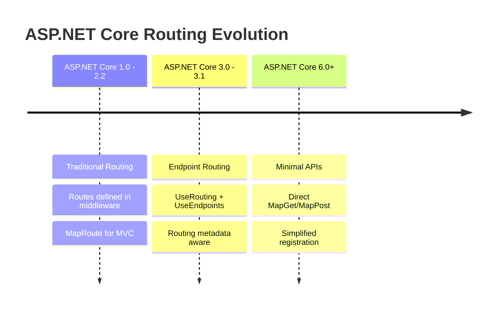
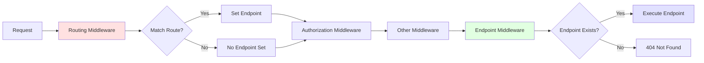
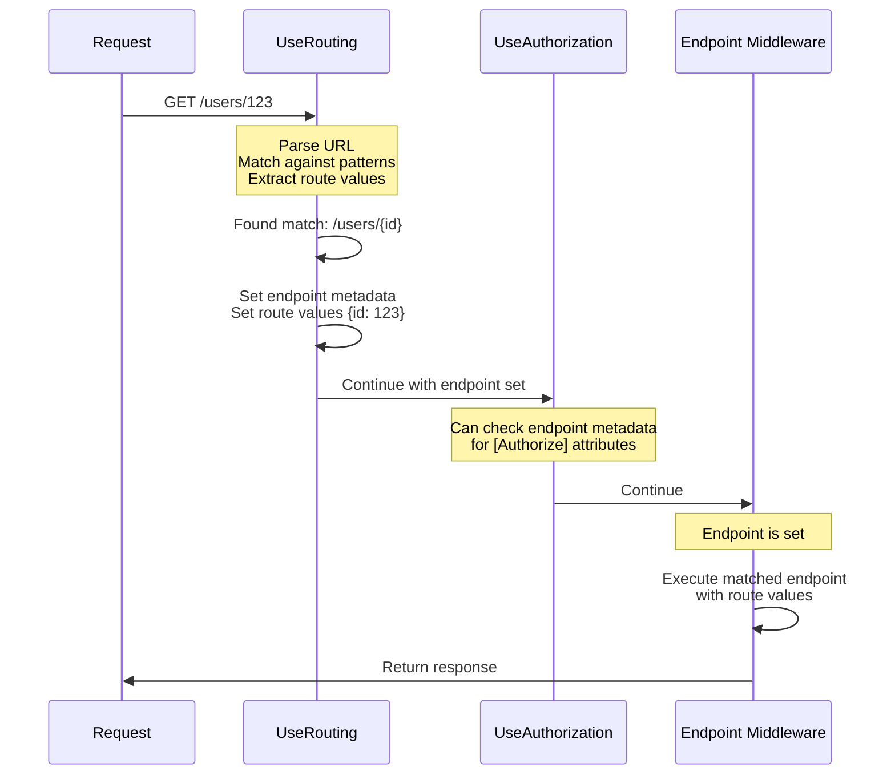
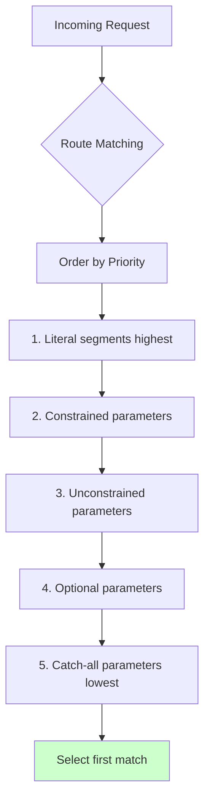

# Understanding the ASP.NET Core Request and Response Pipeline - Part 4: Routing and Endpoints

## Introduction

We've journeyed through the hosting layer, explored Kestrel, and mastered middleware. Now we arrive at a crucial question: once a request makes it through your middleware pipeline, how does ASP.NET Core know which code to execute? The answer is **routing** and **endpoints**.

Routing is the mechanism that matches incoming HTTP requests to executable code. Endpoints are the destinations—the actual code that executes. Together, they form a powerful, flexible system that supports everything from simple route handlers to complex MVC applications.

In this part, we'll explore how routing works, how endpoints are registered and executed, and how you can leverage this system to build sophisticated applications.

## The Evolution of Routing

ASP.NET Core's routing has evolved significantly:



**Traditional Routing (Pre-3.0):**
```csharp
app.UseMvc(routes =>
{
    routes.MapRoute("default", "{controller=Home}/{action=Index}/{id?}");
});
```

**Endpoint Routing (3.0+):**
```csharp
app.UseRouting();
app.UseEndpoints(endpoints =>
{
    endpoints.MapControllers();
});
```

**Modern Minimal APIs (6.0+):**
```csharp
app.MapGet("/users/{id}", (int id) => $"User {id}");
```

## How Routing Works: The Two-Phase Process

Endpoint routing works in two phases:



### Phase 1: Route Matching (`UseRouting()`)

The routing middleware examines the request and tries to match it to a registered endpoint:

```csharp
var builder = WebApplication.CreateBuilder(args);
var app = builder.Build();

// Phase 1: Route matching happens here
app.UseRouting();

// Between routing and endpoints, you can use middleware that needs route information
app.Use(async (context, next) =>
{
    var endpoint = context.GetEndpoint();
    if (endpoint != null)
    {
        Console.WriteLine($"Matched endpoint: {endpoint.DisplayName}");

        // Access route values
        var routeValues = context.Request.RouteValues;
        foreach (var (key, value) in routeValues)
        {
            Console.WriteLine($"  {key} = {value}");
        }
    }

    await next(context);
});

app.UseAuthorization(); // Can make decisions based on matched endpoint

// Phase 2: Endpoint execution happens here
app.MapGet("/users/{id}", (int id) => $"User {id}");

app.Run();
```

**Flow diagram:**



### Phase 2: Endpoint Execution

The endpoint middleware executes the matched endpoint:

```csharp
var builder = WebApplication.CreateBuilder(args);
var app = builder.Build();

app.UseRouting();

// This middleware runs BEFORE endpoint execution
app.Use(async (context, next) =>
{
    Console.WriteLine("Before endpoint execution");
    await next(context);
    Console.WriteLine("After endpoint execution");
});

// Endpoint execution happens here
app.MapGet("/", () =>
{
    Console.WriteLine("Executing endpoint");
    return "Hello World";
});

app.Run();
```

**Output:**
```
Before endpoint execution
Executing endpoint
After endpoint execution
```

## Route Templates

Route templates define the URL pattern to match:

### Basic Templates

```csharp
var builder = WebApplication.CreateBuilder(args);
var app = builder.Build();

// Literal path
app.MapGet("/", () => "Home page");

// Single parameter
app.MapGet("/users/{id}", (int id) => $"User {id}");

// Multiple parameters
app.MapGet("/posts/{year}/{month}/{day}", (int year, int month, int day) =>
    $"Posts from {year}-{month:D2}-{day:D2}");

// Optional parameter
app.MapGet("/products/{id?}", (int? id) =>
    id.HasValue ? $"Product {id}" : "All products");

// Default value
app.MapGet("/search/{query=all}", (string query) =>
    $"Searching for: {query}");

// Catch-all parameter
app.MapGet("/files/{*path}", (string path) =>
    $"File path: {path}");

app.Run();
```

**Examples:**
```
GET /                           → "Home page"
GET /users/123                  → "User 123"
GET /posts/2024/1/15            → "Posts from 2024-01-15"
GET /products                   → "All products"
GET /products/42                → "Product 42"
GET /search                     → "Searching for: all"
GET /search/aspnet              → "Searching for: aspnet"
GET /files/docs/guide.pdf       → "File path: docs/guide.pdf"
```

### Route Constraints

Constraints ensure parameters match specific patterns:

```csharp
var builder = WebApplication.CreateBuilder(args);
var app = builder.Build();

// Integer constraint
app.MapGet("/users/{id:int}", (int id) =>
    $"User {id}");

// Minimum value
app.MapGet("/products/{id:int:min(1)}", (int id) =>
    $"Product {id}");

// Range
app.MapGet("/items/{id:int:range(1,100)}", (int id) =>
    $"Item {id}");

// String length
app.MapGet("/codes/{code:length(5)}", (string code) =>
    $"Code {code}");

// Min/max length
app.MapGet("/names/{name:minlength(2):maxlength(20)}", (string name) =>
    $"Name {name}");

// Regex
app.MapGet("/posts/{slug:regex(^[a-z0-9-]+$)}", (string slug) =>
    $"Post slug: {slug}");

// GUID
app.MapGet("/orders/{id:guid}", (Guid id) =>
    $"Order {id}");

// DateTime
app.MapGet("/appointments/{date:datetime}", (DateTime date) =>
    $"Appointment on {date:yyyy-MM-dd}");

// Alpha (letters only)
app.MapGet("/tags/{tag:alpha}", (string tag) =>
    $"Tag: {tag}");

// Multiple constraints (AND)
app.MapGet("/archive/{year:int:min(2000):max(2030)}", (int year) =>
    $"Archive for {year}");

app.Run();
```

**Built-in constraints:**

| Constraint | Example | Matches |
|------------|---------|---------|
| `int` | `{id:int}` | 123, -456 |
| `bool` | `{active:bool}` | true, false |
| `datetime` | `{date:datetime}` | 2024-01-15 |
| `decimal` | `{price:decimal}` | 19.99 |
| `double` | `{lat:double}` | 51.5074 |
| `float` | `{temp:float}` | 98.6 |
| `guid` | `{id:guid}` | 550e8400-e29b-41d4-a716-446655440000 |
| `long` | `{size:long}` | 9223372036854775807 |
| `minlength(n)` | `{name:minlength(3)}` | abc, abcd |
| `maxlength(n)` | `{name:maxlength(5)}` | abc, abcde |
| `length(n)` | `{code:length(5)}` | abcde |
| `min(n)` | `{age:min(18)}` | 18, 19, 100 |
| `max(n)` | `{age:max(120)}` | 1, 100, 120 |
| `range(min,max)` | `{num:range(1,10)}` | 1, 5, 10 |
| `alpha` | `{tag:alpha}` | abc, XYZ |
| `regex(pattern)` | `{code:regex(^[A-Z]{3}$)}` | ABC, XYZ |
| `required` | `{id:required}` | Any non-empty value |

**Testing constraints:**
```bash
# ✅ Matches {id:int}
GET /users/123          → Success

# ❌ Doesn't match {id:int}
GET /users/abc          → 404

# ✅ Matches {id:int:min(1)}
GET /products/5         → Success

# ❌ Doesn't match {id:int:min(1)}
GET /products/0         → 404
GET /products/-1        → 404
```

### Custom Route Constraints

Create your own constraints:

```csharp
// Custom constraint: validates slugs
public class SlugConstraint : IRouteConstraint
{
    private readonly Regex _regex = new Regex(@"^[a-z0-9]+(?:-[a-z0-9]+)*$",
        RegexOptions.Compiled | RegexOptions.IgnoreCase);

    public bool Match(HttpContext? httpContext, IRouter? route, string routeKey,
        RouteValueDictionary values, RouteDirection routeDirection)
    {
        if (values.TryGetValue(routeKey, out var value) && value != null)
        {
            var slug = value.ToString();
            return !string.IsNullOrEmpty(slug) && _regex.IsMatch(slug);
        }

        return false;
    }
}

// Register the constraint
var builder = WebApplication.CreateBuilder(args);

builder.Services.Configure<RouteOptions>(options =>
{
    options.ConstraintMap.Add("slug", typeof(SlugConstraint));
});

var app = builder.Build();

// Use the custom constraint
app.MapGet("/blog/{slug:slug}", (string slug) =>
    $"Blog post: {slug}");

app.Run();
```

**Testing:**
```bash
GET /blog/my-first-post          → ✅ "Blog post: my-first-post"
GET /blog/hello-world-2024       → ✅ "Blog post: hello-world-2024"
GET /blog/My_Invalid_Slug        → ❌ 404
GET /blog/has spaces             → ❌ 404
```

## Route Priorities and Ordering

When multiple routes match, ASP.NET Core uses a priority system:



**Example:**

```csharp
var builder = WebApplication.CreateBuilder(args);
var app = builder.Build();

// Priority 1: Literal segments (highest priority)
app.MapGet("/users/admin", () => "Admin user endpoint");

// Priority 2: Constrained parameter
app.MapGet("/users/{id:int}", (int id) => $"User {id}");

// Priority 3: Unconstrained parameter
app.MapGet("/users/{username}", (string username) => $"User @{username}");

// Priority 4: Optional parameter
app.MapGet("/users/{id:int?}", (int? id) =>
    id.HasValue ? $"User {id}" : "All users");

// Priority 5: Catch-all (lowest priority)
app.MapGet("/users/{*path}", (string path) => $"Catch-all: {path}");

app.Run();
```

**Matching behavior:**
```bash
GET /users/admin        → "Admin user endpoint" (literal match)
GET /users/123          → "User 123" (constrained parameter)
GET /users/john         → "User @john" (unconstrained parameter)
GET /users/admin/test   → "Catch-all: admin/test" (catch-all)
```

You can also set explicit order:

```csharp
app.MapGet("/products/{id}", (int id) => $"Product {id}")
    .WithOrder(1);

app.MapGet("/products/featured", () => "Featured products")
    .WithOrder(0); // Lower number = higher priority
```

## Parameter Binding

ASP.NET Core can bind route parameters from multiple sources:

### Route Values

```csharp
app.MapGet("/users/{id}/posts/{postId}", (int id, int postId) =>
    $"User {id}, Post {postId}");
```

### Query String

```csharp
app.MapGet("/search", (string? q, int page = 1, int pageSize = 10) =>
    $"Query: {q}, Page: {page}, Size: {pageSize}");

// GET /search?q=aspnet&page=2&pageSize=20
```

### Headers

```csharp
app.MapGet("/api/data", ([FromHeader(Name = "X-API-Key")] string apiKey) =>
    $"API Key: {apiKey}");
```

### Body

```csharp
app.MapPost("/users", ([FromBody] User user) =>
{
    return Results.Created($"/users/{user.Id}", user);
});

public record User(int Id, string Name, string Email);
```

### Services (Dependency Injection)

```csharp
app.MapGet("/data", (IMyService service) =>
{
    var data = service.GetData();
    return data;
});
```

### HttpContext

```csharp
app.MapGet("/info", (HttpContext context) =>
{
    var userAgent = context.Request.Headers["User-Agent"];
    var ip = context.Connection.RemoteIpAddress;

    return new
    {
        UserAgent = userAgent.ToString(),
        IpAddress = ip?.ToString()
    };
});
```

### Complex Binding Example

```csharp
public record CreatePostRequest(string Title, string Content, List<string> Tags);

app.MapPost("/api/posts",
    async (
        [FromRoute] int userId,
        [FromQuery] bool publish,
        [FromBody] CreatePostRequest request,
        [FromHeader(Name = "X-Request-ID")] string requestId,
        [FromServices] IPostService postService,
        HttpContext context) =>
    {
        var post = await postService.CreatePostAsync(
            userId,
            request.Title,
            request.Content,
            request.Tags,
            publish
        );

        context.Response.Headers["X-Request-ID"] = requestId;

        return Results.Created($"/api/posts/{post.Id}", post);
    });

// POST /api/posts?publish=true
// Header: X-Request-ID: abc123
// Body: { "title": "Hello", "content": "World", "tags": ["aspnet", "routing"] }
```

## Endpoint Metadata

Endpoints can have metadata that describes them:

```csharp
var builder = WebApplication.CreateBuilder(args);

builder.Services.AddAuthorization();

var app = builder.Build();

app.UseAuthorization();

// Add metadata with extension methods
app.MapGet("/public", () => "Public endpoint")
    .WithName("GetPublic")
    .WithDisplayName("Public Endpoint")
    .WithDescription("A public endpoint that anyone can access")
    .WithTags("Public");

app.MapGet("/private", () => "Private endpoint")
    .RequireAuthorization() // Adds [Authorize] metadata
    .WithName("GetPrivate");

app.MapGet("/admin", () => "Admin only")
    .RequireAuthorization("AdminPolicy");

// Access metadata
app.Map("/metadata", (IEndpointRouteBuilder endpoints) =>
{
    var dataSources = endpoints.DataSources;

    var endpointList = dataSources
        .SelectMany(ds => ds.Endpoints)
        .OfType<RouteEndpoint>()
        .Select(e => new
        {
            Name = e.Metadata.GetMetadata<IEndpointNameMetadata>()?.EndpointName,
            DisplayName = e.DisplayName,
            Route = e.RoutePattern.RawText,
            RequiresAuth = e.Metadata.GetMetadata<IAuthorizeData>() != null
        });

    return endpointList;
});

app.Run();
```

**Output from `/metadata`:**
```json
[
  {
    "name": "GetPublic",
    "displayName": "Public Endpoint",
    "route": "/public",
    "requiresAuth": false
  },
  {
    "name": "GetPrivate",
    "displayName": null,
    "route": "/private",
    "requiresAuth": true
  },
  {
    "name": null,
    "displayName": null,
    "route": "/admin",
    "requiresAuth": true
  }
]
```

## Route Groups

Group related endpoints with shared configuration:

```csharp
var builder = WebApplication.CreateBuilder(args);
var app = builder.Build();

// Create a group with common prefix
var api = app.MapGroup("/api");

// All these routes are prefixed with /api
api.MapGet("/users", () => "Get all users");
api.MapGet("/users/{id}", (int id) => $"Get user {id}");
api.MapPost("/users", () => "Create user");

// Nested groups
var v1 = api.MapGroup("/v1");
v1.MapGet("/products", () => "V1 products");

var v2 = api.MapGroup("/v2");
v2.MapGet("/products", () => "V2 products");

// Groups with shared metadata
var adminApi = app.MapGroup("/admin")
    .RequireAuthorization("AdminPolicy")
    .WithTags("Admin");

adminApi.MapGet("/users", () => "Admin: Get users");
adminApi.MapDelete("/users/{id}", (int id) => $"Admin: Delete user {id}");

app.Run();
```

**Routes created:**
```
GET    /api/users
GET    /api/users/{id}
POST   /api/users
GET    /api/v1/products
GET    /api/v2/products
GET    /admin/users          [Authorize(AdminPolicy)]
DELETE /admin/users/{id}     [Authorize(AdminPolicy)]
```

**Visualization:**

```mermaid
graph TD
    Root[Root] --> Api[/api]
    Root --> Admin[/admin RequireAuth]

    Api --> Users1[GET /users]
    Api --> Users2[GET /users/{id}]
    Api --> Users3[POST /users]
    Api --> V1[/v1]
    Api --> V2[/v2]

    V1 --> V1Products[GET /products]
    V2 --> V2Products[GET /products]

    Admin --> AdminUsers[GET /users]
    Admin --> AdminDelete[DELETE /users/{id}]

    style Admin fill:#ffe1e1
    style V1 fill:#e1ffe1
    style V2 fill:#e1e1ff
```

## Advanced Routing Scenarios

### Content Negotiation by Route

```csharp
app.MapGet("/data.json", () => Results.Json(new { data = "JSON" }));
app.MapGet("/data.xml", () => Results.Text("<data>XML</data>", "application/xml"));
app.MapGet("/data", (HttpContext context) =>
{
    var accept = context.Request.Headers["Accept"].ToString();

    if (accept.Contains("application/json"))
        return Results.Json(new { data = "JSON" });

    if (accept.Contains("application/xml"))
        return Results.Text("<data>XML</data>", "application/xml");

    return Results.Json(new { data = "Default JSON" });
});
```

### Localized Routes

```csharp
// English routes
app.MapGet("/en/products", () => "Products");
app.MapGet("/en/about", () => "About Us");

// Spanish routes
app.MapGet("/es/productos", () => "Productos");
app.MapGet("/es/acerca", () => "Acerca de Nosotros");

// Dynamic culture from route
app.MapGet("/{culture}/home", (string culture) =>
{
    CultureInfo.CurrentCulture = new CultureInfo(culture);
    return $"Home (Culture: {culture})";
});
```

### Versioned APIs

```csharp
// Version in route
var v1 = app.MapGroup("/api/v1");
v1.MapGet("/users", () => new { version = 1, users = new[] { "Alice", "Bob" } });

var v2 = app.MapGroup("/api/v2");
v2.MapGet("/users", () => new { version = 2, users = new[]
{
    new { id = 1, name = "Alice" },
    new { id = 2, name = "Bob" }
}});

// Version in query string
app.MapGet("/api/users", (int version = 1) =>
{
    if (version == 2)
        return Results.Json(new { version = 2, users = new[]
        {
            new { id = 1, name = "Alice" },
            new { id = 2, name = "Bob" }
        }});

    return Results.Json(new { version = 1, users = new[] { "Alice", "Bob" } });
});

// Version in header
app.MapGet("/api/data", (HttpContext context) =>
{
    var version = context.Request.Headers["X-API-Version"].FirstOrDefault() ?? "1";

    return version switch
    {
        "2" => Results.Json(new { version = 2, data = "New format" }),
        _ => Results.Json(new { version = 1, data = "Old format" })
    };
});
```

### Subdomain Routing

```csharp
app.Use(async (context, next) =>
{
    var host = context.Request.Host.Host;

    if (host.StartsWith("api."))
    {
        context.Request.RouteValues["area"] = "api";
    }
    else if (host.StartsWith("admin."))
    {
        context.Request.RouteValues["area"] = "admin";
    }

    await next(context);
});

app.MapGet("/", (HttpContext context) =>
{
    var area = context.Request.RouteValues["area"]?.ToString() ?? "main";

    return area switch
    {
        "api" => "API area",
        "admin" => "Admin area",
        _ => "Main area"
    };
});
```

## Route Debugging

View all registered routes:

```csharp
var builder = WebApplication.CreateBuilder(args);
var app = builder.Build();

app.MapGet("/users", () => "Users");
app.MapPost("/users", () => "Create user");
app.MapGet("/products/{id:int}", (int id) => $"Product {id}");

// Endpoint to inspect all routes
app.MapGet("/routes", (IEnumerable<EndpointDataSource> endpointSources) =>
{
    var endpoints = endpointSources
        .SelectMany(es => es.Endpoints)
        .OfType<RouteEndpoint>();

    var routes = endpoints.Select(e => new
    {
        Name = e.Metadata.GetMetadata<IEndpointNameMetadata>()?.EndpointName,
        Pattern = e.RoutePattern.RawText,
        Order = e.Order,
        HttpMethods = e.Metadata.GetMetadata<IHttpMethodMetadata>()?.HttpMethods,
        Metadata = e.Metadata.Select(m => m.GetType().Name)
    });

    return Results.Json(routes);
});

app.Run();
```

**Output from `/routes`:**
```json
[
  {
    "name": null,
    "pattern": "/users",
    "order": 0,
    "httpMethods": ["GET"],
    "metadata": ["HttpMethodMetadata", ...]
  },
  {
    "name": null,
    "pattern": "/users",
    "order": 0,
    "httpMethods": ["POST"],
    "metadata": ["HttpMethodMetadata", ...]
  },
  {
    "name": null,
    "pattern": "/products/{id:int}",
    "order": 0,
    "httpMethods": ["GET"],
    "metadata": ["HttpMethodMetadata", "RoutePatternMetadata", ...]
  }
]
```

## Performance Considerations

### Route Caching

```csharp
// Routes are compiled and cached at startup
// This is fast:
for (int i = 0; i < 1000; i++)
{
    app.MapGet($"/endpoint{i}", () => $"Endpoint {i}");
}

// At runtime, route matching is O(1) for most cases
```

### Link Generation

Generate URLs from routes:

```csharp
app.MapGet("/users/{id}", (int id) => $"User {id}")
    .WithName("GetUser");

app.MapGet("/generate-link", (LinkGenerator linkGenerator, HttpContext context) =>
{
    var url = linkGenerator.GetPathByName("GetUser", new { id = 123 });
    // url = "/users/123"

    var absoluteUrl = linkGenerator.GetUriByName(context, "GetUser", new { id = 123 });
    // absoluteUrl = "https://localhost:5001/users/123"

    return new { url, absoluteUrl };
});
```

## Key Takeaways

- Routing is a two-phase process: matching (UseRouting) and execution (endpoints)
- Route templates support parameters, constraints, optional values, and catch-alls
- Built-in constraints validate parameter types and patterns
- Custom constraints provide application-specific validation
- Route priority: literals > constrained parameters > unconstrained > optional > catch-all
- Parameters can bind from routes, query string, headers, body, and services
- Endpoint metadata enables features like authorization and documentation
- Route groups simplify configuration for related endpoints
- Link generation creates URLs from route names
- The routing system is highly optimized for performance

Routing and endpoints form the bridge between HTTP requests and your application code. Mastering this system gives you precise control over how URLs map to functionality.

---

*Continue to Part 5: MVC, Razor Pages, and Minimal APIs to learn how different application models leverage the routing and endpoint system.*
