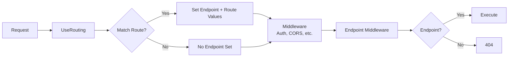

# Understanding the ASP.NET Core Pipeline - Part 4: Routing (How URLs Actually Find Your Code)

<!--category-- ASP.NET Core, C#, Routing, Endpoints -->
<datetime class="hidden">2024-11-08T03:00</datetime>

> **AI GENERATED** - If that offends you, please stop reading.

# Introduction

So you've got middleware processing requests. Great. But HOW does ASP.NET Core know which code to execute for `/api/users/123` versus `/products/shoes`?

That's routing. And it's more important than you think.

I've seen developers treat routing as magic - copy some `[Route]` attributes, hope for the best. Then wonder why their API returns 404 for URLs that should work, or why two endpoints conflict.

Routing is NOT complicated. It's pattern matching + metadata. Understand it and you'll never be confused again.

[TOC]

# The Problem

Most developers think routing just "works." Until it doesn't:

- Multiple routes match the same URL (which wins?)
- Route parameters don't bind (was it `{id}` or `{userId}`?)
- Constraints fail silently (why does `/api/users/abc` return 404?)
- CORS preflight fails (routing hasn't matched yet?)

**ROUTING IS TWO PHASES - MATCHING AND EXECUTION**

# How Routing ACTUALLY Works

Modern ASP.NET Core (3.0+) uses endpoint routing, which is a two-phase process:



**Phase 1: `UseRouting()`** - Matches the URL pattern, sets the endpoint
**Phase 2: Endpoint middleware** - Actually executes the matched endpoint

This separation is CRITICAL. Between matching and execution, other middleware (auth, CORS) can see WHICH endpoint was matched and make decisions based on it.

```csharp
var builder = WebApplication.CreateBuilder(args);
var app = builder.Build();

// Phase 1: Match the route
app.UseRouting();

// Between phases: Middleware can see the matched endpoint
app.Use(async (context, next) =>
{
    var endpoint = context.GetEndpoint();
    if (endpoint != null)
    {
        Console.WriteLine($"Matched: {endpoint.DisplayName}");

        // Access route values
        if (context.Request.RouteValues.TryGetValue("id", out var id))
        {
            Console.WriteLine($"ID parameter: {id}");
        }
    }

    await next(context);
});

app.UseAuthorization(); // Can check endpoint metadata for [Authorize]

// Phase 2: Execute the endpoint
app.MapGet("/users/{id:int}", (int id) => $"User {id}");

app.Run();
```

WHY this matters: CORS middleware needs to know which endpoint was matched to apply the right policy. Auth middleware needs to see if the endpoint has `[Authorize]`. This all happens BETWEEN routing and execution.

# Route Templates - The Pattern Language

Route templates define URL patterns. Simple concept, lots of options:

```csharp
// Literal path
app.MapGet("/", () => "Home");

// Single parameter
app.MapGet("/users/{id}", (int id) => $"User {id}");

// Multiple parameters
app.MapGet("/posts/{year}/{month}/{day}",
    (int year, int month, int day) => $"Posts: {year}-{month}-{day}");

// Optional parameter
app.MapGet("/products/{id?}", (int? id) =>
    id.HasValue ? $"Product {id}" : "All products");

// Default value
app.MapGet("/search/{query=all}", (string query) => $"Search: {query}");

// Catch-all
app.MapGet("/files/{*path}", (string path) => $"File: {path}");
```

**Examples:**
```
GET /                       → Home
GET /users/123              → User 123
GET /posts/2024/11/8        → Posts: 2024-11-8
GET /products               → All products
GET /products/42            → Product 42
GET /search                 → Search: all
GET /search/aspnet          → Search: aspnet
GET /files/docs/guide.pdf   → File: docs/guide.pdf
```

Simple, right? The power is in CONSTRAINTS.

# Route Constraints - Making Routes Specific

Constraints ensure parameters match specific patterns:

```csharp
// Integer only
app.MapGet("/users/{id:int}", (int id) => $"User {id}");

// GUID
app.MapGet("/orders/{id:guid}", (Guid id) => $"Order {id}");

// Min/max
app.MapGet("/products/{id:int:min(1)}", (int id) => $"Product {id}");

// Range
app.MapGet("/items/{id:int:range(1,100)}", (int id) => $"Item {id}");

// Length
app.MapGet("/codes/{code:length(5)}", (string code) => $"Code {code}");

// Regex
app.MapGet("/posts/{slug:regex(^[a-z0-9-]+$)}", (string slug) => $"Post {slug}");

// Multiple constraints (AND)
app.MapGet("/archive/{year:int:min(2000):max(2030)}", (int year) => $"Year {year}");
```

**Testing:**
```bash
GET /users/123          → ✅ User 123
GET /users/abc          → ❌ 404 (not an int)
GET /products/0         → ❌ 404 (min is 1)
GET /products/5         → ✅ Product 5
GET /codes/ABC12        → ❌ 404 (not length 5)
GET /codes/ABC12        → ✅ Code ABC12
```

Constraints fail SILENTLY - they just don't match. No error, just 404.

## Common Constraints

| Constraint | Matches |
|------------|---------|
| `int` | Integer numbers |
| `bool` | true, false |
| `datetime` | Date/time |
| `decimal` | Decimal numbers |
| `guid` | GUID format |
| `long` | Long integer |
| `min(n)` | Minimum value |
| `max(n)` | Maximum value |
| `range(min,max)` | Value range |
| `minlength(n)` | Minimum string length |
| `maxlength(n)` | Maximum string length |
| `length(n)` | Exact string length |
| `alpha` | Letters only |
| `regex(pattern)` | Regex pattern |

# Route Priority - When Multiple Routes Match

If multiple routes match, ASP.NET Core uses this priority order:

1. **Literal segments** (highest priority)
2. **Constrained parameters**
3. **Unconstrained parameters**
4. **Optional parameters**
5. **Catch-all parameters** (lowest priority)

```csharp
// Priority 1: Literal (highest)
app.MapGet("/users/admin", () => "Admin page");

// Priority 2: Constrained parameter
app.MapGet("/users/{id:int}", (int id) => $"User {id}");

// Priority 3: Unconstrained parameter
app.MapGet("/users/{username}", (string username) => $"User @{username}");

// Priority 4: Catch-all (lowest)
app.MapGet("/users/{*path}", (string path) => $"Catch-all: {path}");
```

**Matching:**
```
GET /users/admin     → "Admin page" (literal wins)
GET /users/123       → "User 123" (constrained wins over unconstrained)
GET /users/john      → "User @john" (unconstrained wins over catch-all)
GET /users/a/b/c     → "Catch-all: a/b/c" (catch-all gets everything else)
```

You can also set explicit order:

```csharp
app.MapGet("/products/{id}", (int id) => $"Product {id}")
    .WithOrder(1);

app.MapGet("/products/featured", () => "Featured")
    .WithOrder(0); // Lower number = higher priority
```

# Parameter Binding - Where Data Comes From

Parameters can bind from multiple sources:

```csharp
// From route
app.MapGet("/users/{id}", (int id) => ...);

// From query string
app.MapGet("/search", (string q, int page = 1) => ...);
// GET /search?q=aspnet&page=2

// From header
app.MapGet("/api/data",
    ([FromHeader(Name = "X-API-Key")] string apiKey) => ...);

// From body (POST/PUT)
app.MapPost("/users", ([FromBody] User user) => ...);

// From services (DI)
app.MapGet("/data", (IMyService service) => ...);

// From HttpContext
app.MapGet("/info", (HttpContext context) => ...);

// Mix and match
app.MapPost("/users/{id}/posts",
    (int id,                                    // From route
     [FromQuery] bool publish,                  // From query string
     [FromBody] Post post,                      // From body
     [FromServices] IPostService service,       // From DI
     HttpContext context) =>                    // Context
{
    // All bound automatically
});
```

*NOTE: ASP.NET Core is smart about binding. It looks at route first, then query string, then body for complex types.*

# Route Groups - Organization

Group related routes with shared configuration:

```csharp
var api = app.MapGroup("/api");

api.MapGet("/users", () => "Get users");
api.MapPost("/users", () => "Create user");
api.MapGet("/products", () => "Get products");

// Nested groups
var v1 = api.MapGroup("/v1");
v1.MapGet("/data", () => "V1 data");

var v2 = api.MapGroup("/v2");
v2.MapGet("/data", () => "V2 data");

// Groups with middleware/metadata
var admin = app.MapGroup("/admin")
    .RequireAuthorization("AdminPolicy")
    .WithTags("Admin");

admin.MapGet("/users", () => "Admin users");
admin.MapDelete("/users/{id}", (int id) => $"Delete {id}");
```

**Routes created:**
```
GET    /api/users
POST   /api/users
GET    /api/products
GET    /api/v1/data
GET    /api/v2/data
GET    /admin/users       [RequiresAuthorization]
DELETE /admin/users/{id}  [RequiresAuthorization]
```

```mermaid
graph TD
    Root[Root] --> API[/api]
    Root --> Admin[/admin RequireAuth]

    API --> Users1[GET /users]
    API --> Users2[POST /users]
    API --> Products[GET /products]
    API --> V1[/v1]
    API --> V2[/v2]

    V1 --> V1Data[GET /data]
    V2 --> V2Data[GET /data]

    Admin --> AdminUsers[GET /users]
    Admin --> AdminDelete[DELETE /users/{id}]
```

# Real-World Examples

## API Versioning

```csharp
var v1 = app.MapGroup("/api/v1");
v1.MapGet("/users", () => new { version = 1, users = new[] { "Alice", "Bob" } });

var v2 = app.MapGroup("/api/v2");
v2.MapGet("/users", () => new
{
    version = 2,
    users = new[]
    {
        new { id = 1, name = "Alice" },
        new { id = 2, name = "Bob" }
    }
});

// Version in query string
app.MapGet("/api/users", (int version = 1) =>
{
    return version == 2
        ? Results.Json(new { version = 2, users = new[] { new { id = 1, name = "Alice" } } })
        : Results.Json(new { version = 1, users = new[] { "Alice" } });
});
```

## Localized Routes

```csharp
// English
app.MapGet("/en/products", () => "Products");
app.MapGet("/en/about", () => "About Us");

// Spanish
app.MapGet("/es/productos", () => "Productos");
app.MapGet("/es/acerca", () => "Acerca de Nosotros");

// Dynamic culture
app.MapGet("/{culture}/home", (string culture) =>
{
    CultureInfo.CurrentCulture = new CultureInfo(culture);
    return $"Home (Culture: {culture})";
});
```

## Debugging Routes

See all registered routes:

```csharp
app.MapGet("/routes", (IEnumerable<EndpointDataSource> sources) =>
{
    var endpoints = sources
        .SelectMany(s => s.Endpoints)
        .OfType<RouteEndpoint>()
        .Select(e => new
        {
            Pattern = e.RoutePattern.RawText,
            Order = e.Order,
            Methods = e.Metadata.GetMetadata<IHttpMethodMetadata>()?.HttpMethods
        });

    return endpoints;
});
```

**Output:**
```json
[
  {
    "pattern": "/users/{id:int}",
    "order": 0,
    "methods": ["GET"]
  },
  {
    "pattern": "/products",
    "order": 0,
    "methods": ["GET", "POST"]
  }
]
```

# Common Routing Mistakes

## Mistake 1: Route Order Wrong

```csharp
// WRONG - specific route after general route
app.MapGet("/users/{username}", (string username) => $"User @{username}");
app.MapGet("/users/admin", () => "Admin"); // NEVER MATCHES

// RIGHT - specific route first
app.MapGet("/users/admin", () => "Admin");
app.MapGet("/users/{username}", (string username) => $"User @{username}");
```

Or use constraints:

```csharp
app.MapGet("/users/admin", () => "Admin");
app.MapGet("/users/{id:int}", (int id) => $"User ID {id}");
app.MapGet("/users/{username:alpha}", (string username) => $"User @{username}");
```

## Mistake 2: Missing Constraints

```csharp
// WRONG - accepts any string
app.MapGet("/users/{id}", (int id) => ...); // BOOM when id = "abc"

// RIGHT - constrain to int
app.MapGet("/users/{id:int}", (int id) => ...); // "abc" returns 404
```

## Mistake 3: UseRouting After Endpoints

```csharp
// WRONG
app.MapControllers();
app.UseRouting(); // TOO LATE

// RIGHT
app.UseRouting();
app.MapControllers();
```

# In Conclusion

Routing is pattern matching with metadata. It's not magic.

Key points:
1. **Two phases** - Matching (`UseRouting`) and execution (endpoint middleware)
2. **Constraints matter** - Use them to make routes specific
3. **Priority is predictable** - Literals > constrained > unconstrained > catch-all
4. **Binding is automatic** - Route, query, header, body, services
5. **Groups organize** - Shared configuration for related routes

In Part 5 we'll cover the different application models (MVC, Razor Pages, Minimal APIs) and how they use routing differently.

Now go add proper constraints to your routes before someone sends `/users/😈` and breaks your app!
