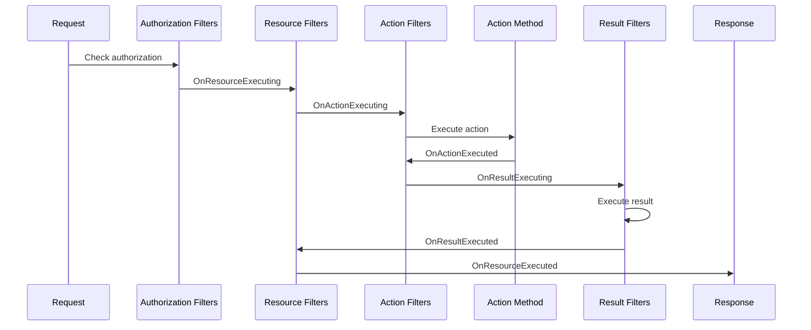

# Understanding the ASP.NET Core Pipeline - Part 5: Minimal APIs vs MVC vs Razor Pages (Choosing Your Poison)

<!--category-- AI-Article, ASP.NET Core Series, ASP.NET Core, C#, MVC, Razor Pages, Minimal APIs -->
<datetime class="hidden">2024-11-08T04:00</datetime>

> **AI GENERATED** - If that offends you, please stop reading.

# Introduction

So you know the pipeline, you understand routing. Now the question: HOW do you actually write your endpoints?

ASP.NET Core gives you THREE choices:
1. **Minimal APIs** - Simple, fast, minimal ceremony
2. **Razor Pages** - Page-focused web UI
3. **MVC** - Full-featured, structured, the "old" way

And developers get VERY opinionated about which one to use. Let me save you some time: THEY ALL USE THE SAME PIPELINE. They're just different ways of organizing code.

[TOC]

# The Problem

I see developers agonizing over which model to choose. Should I use Minimal APIs or MVC? Can I mix them? When should I use Razor Pages?

Here's the truth: **Pick based on what you're building, not what's trendy.**

Building a simple microservice? Minimal APIs.
Building a CRUD-heavy web app? Razor Pages.
Building a complex API with lots of structure? MVC.

They all compile to the same thing - endpoints in the pipeline.

# Minimal APIs - The Lightweight Choice

Minimal APIs were added in .NET 6 to reduce ceremony. Less code, faster startup, perfect for microservices.

```csharp
var builder = WebApplication.CreateBuilder(args);

builder.Services.AddSingleton<IProductService, ProductService>();

var app = builder.Build();

// That's it - define endpoints inline
app.MapGet("/products", (IProductService service) =>
{
    return service.GetAll();
});

app.MapGet("/products/{id:int}", (int id, IProductService service) =>
{
    var product = service.GetById(id);
    return product != null
        ? Results.Ok(product)
        : Results.NotFound();
});

app.MapPost("/products", ([FromBody] Product product, IProductService service) =>
{
    service.Add(product);
    return Results.Created($"/products/{product.Id}", product);
});

app.Run();
```

THAT'S IT. No controllers, no action methods, no attributes (well, except `[FromBody]`).

## When to Use Minimal APIs

**GOOD FOR:**
- **Microservices** - Small, focused APIs
- **Serverless** - Azure Functions, AWS Lambda
- **Quick prototypes** - Get something running fast
- **Simple APIs** - CRUD operations, webhooks

**NOT GOOD FOR:**
- **Complex APIs** - Lots of endpoints, shared logic
- **When you need structure** - Large teams, conventions

## Parameter Binding

Minimal APIs are SMART about parameter binding:

```csharp
app.MapPost("/create",
    (int id,                                // From route? Query? - ASP.NET figures it out
     [FromQuery] string? filter,            // Explicitly from query string
     [FromHeader(Name = "X-Key")] string key, // From header
     [FromBody] Product product,            // From request body
     [FromServices] ILogger logger,         // From DI container
     HttpContext context) =>                // Special type, injected
{
    // All parameters bound automatically
    logger.LogInformation("Creating product {Id}", product.Id);
    return Results.Created($"/products/{product.Id}", product);
});
```

## Filters

You can add filters to Minimal APIs:

```csharp
app.MapGet("/data", () => "Data")
    .AddEndpointFilter(async (context, next) =>
    {
        // Before endpoint
        Console.WriteLine("Before");

        var result = await next(context);

        // After endpoint
        Console.WriteLine("After");

        return result;
    });

// Validation filter
app.MapPost("/users", ([FromBody] User user) => Results.Ok(user))
    .AddEndpointFilter(async (context, next) =>
    {
        var user = context.GetArgument<User>(0);

        if (string.IsNullOrWhiteSpace(user.Name))
        {
            return Results.BadRequest("Name is required");
        }

        return await next(context);
    });
```

# Razor Pages - Page-Focused Web UI

Razor Pages is ASP.NET Core's answer to "I just want to build a web app without all the MVC ceremony."

Each page is self-contained: URL maps directly to a file.

```
Pages/
  Index.cshtml        → /
  Index.cshtml.cs
  Products/
    List.cshtml       → /products/list
    List.cshtml.cs
    Details.cshtml    → /products/details
    Details.cshtml.cs
```

**Pages/Products/List.cshtml.cs:**
```csharp
public class ListModel : PageModel
{
    private readonly IProductService _service;

    public ListModel(IProductService service)
    {
        _service = service;
    }

    public List<Product> Products { get; set; } = new();

    public async Task OnGetAsync()
    {
        Products = await _service.GetAllAsync();
    }
}
```

**Pages/Products/List.cshtml:**
```cshtml
@page
@model ListModel

<h1>Products</h1>

<ul>
@foreach (var product in Model.Products)
{
    <li>@product.Name - $@product.Price</li>
}
</ul>
```

Simple, right? URL `/products/list` maps to `Pages/Products/List.cshtml`. No routing configuration needed.

## Handlers

Pages support multiple handlers:

```csharp
public class ContactModel : PageModel
{
    [BindProperty]
    public string Email { get; set; } = "";

    public string Message { get; set; } = "";

    // GET handler
    public void OnGet()
    {
    }

    // POST handler (default)
    public IActionResult OnPost()
    {
        if (string.IsNullOrWhiteSpace(Email))
        {
            Message = "Email required";
            return Page();
        }

        Message = "Form submitted!";
        return Page();
    }

    // Named handler: POST with ?handler=subscribe
    public IActionResult OnPostSubscribe(string email)
    {
        Message = $"Subscribed: {email}";
        return Page();
    }
}
```

**In the view:**
```cshtml
<!-- Default POST handler -->
<form method="post">
    <input asp-for="Email" />
    <button type="submit">Submit</button>
</form>

<!-- Named handler -->
<form method="post" asp-page-handler="Subscribe">
    <input name="email" />
    <button type="submit">Subscribe</button>
</form>
```

## When to Use Razor Pages

**GOOD FOR:**
- **Page-focused apps** - Content sites, admin panels
- **CRUD operations** - Forms, data entry
- **Simpler than MVC** - Less ceremony, easier to understand
- **Self-contained logic** - Each page owns its logic

**NOT GOOD FOR:**
- **Complex routing** - Attribute routing is limited
- **Reusable actions** - Hard to share logic between pages
- **When you need MVC structure** - Large, complex apps

# MVC - The Full-Featured Framework

MVC (Model-View-Controller) is the "traditional" way. More ceremony, more structure, more power.

```
Controllers/
  ProductsController.cs
Models/
  Product.cs
  CreateProductViewModel.cs
Views/
  Products/
    Index.cshtml
    Details.cshtml
    Create.cshtml
  Shared/
    _Layout.cshtml
```

**ProductsController.cs:**
```csharp
[Route("products")]
public class ProductsController : Controller
{
    private readonly IProductService _service;

    public ProductsController(IProductService service)
    {
        _service = service;
    }

    // GET: /products
    [HttpGet]
    public async Task<IActionResult> Index()
    {
        var products = await _service.GetAllAsync();
        return View(products);
    }

    // GET: /products/123
    [HttpGet("{id:int}")]
    public async Task<IActionResult> Details(int id)
    {
        var product = await _service.GetByIdAsync(id);

        if (product == null)
            return NotFound();

        return View(product);
    }

    // GET: /products/create
    [HttpGet("create")]
    public IActionResult Create()
    {
        return View();
    }

    // POST: /products/create
    [HttpPost("create")]
    [ValidateAntiForgeryToken]
    public async Task<IActionResult> Create(CreateProductViewModel model)
    {
        if (!ModelState.IsValid)
            return View(model);

        var product = await _service.CreateAsync(model);

        return RedirectToAction(nameof(Details), new { id = product.Id });
    }
}
```

More code, but also more structure.

## Action Results

MVC has LOTS of result types:

```csharp
public class ResultsController : Controller
{
    // View
    public IActionResult Index() => View();

    // View with model
    public IActionResult Details(int id) => View(new Product { Id = id });

    // JSON
    public IActionResult GetJson() => Json(new { id = 1, name = "Product" });

    // Redirect
    public IActionResult GoHome() => RedirectToAction("Index", "Home");

    // File download
    public IActionResult Download() => File(bytes, "application/pdf", "file.pdf");

    // Status codes
    public IActionResult NotFoundExample() => NotFound();
    public IActionResult BadRequestExample() => BadRequest("Invalid input");
    public IActionResult UnauthorizedExample() => Unauthorized();

    // Content
    public IActionResult GetText() => Content("Plain text", "text/plain");
}
```

## Filters

MVC has a FULL filter pipeline:



```csharp
// Filter types in order of execution

// 1. Authorization filter
public class CustomAuthorizeAttribute : Attribute, IAuthorizationFilter
{
    public void OnAuthorization(AuthorizationFilterContext context)
    {
        if (!context.HttpContext.User.Identity?.IsAuthenticated ?? true)
        {
            context.Result = new UnauthorizedResult();
        }
    }
}

// 2. Action filter
public class LogActionFilter : IActionFilter
{
    public void OnActionExecuting(ActionExecutingContext context)
    {
        // Before action executes
        Console.WriteLine($"Executing {context.ActionDescriptor.DisplayName}");
    }

    public void OnActionExecuted(ActionExecutedContext context)
    {
        // After action executes
        Console.WriteLine($"Executed with result: {context.Result?.GetType().Name}");
    }
}

// 3. Result filter
public class AddHeaderFilter : IResultFilter
{
    public void OnResultExecuting(ResultExecutingContext context)
    {
        context.HttpContext.Response.Headers["X-Custom"] = "Value";
    }

    public void OnResultExecuted(ResultExecutedContext context)
    {
        // After result executes
    }
}

// Apply globally
builder.Services.AddControllersWithViews(options =>
{
    options.Filters.Add<LogActionFilter>();
});

// Or per controller/action
[ServiceFilter(typeof(LogActionFilter))]
public class ProductsController : Controller
{
}
```

## When to Use MVC

**GOOD FOR:**
- **Complex applications** - Large codebases, multiple teams
- **Reusable logic** - Filters, action methods shared across controllers
- **Convention over configuration** - You want structure
- **API + Views** - Need both

**NOT GOOD FOR:**
- **Simple APIs** - Too much ceremony
- **Learning ASP.NET** - Start with Minimal APIs
- **Microservices** - Overkill

# Comparing the Three

| Feature | Minimal APIs | Razor Pages | MVC |
|---------|--------------|-------------|-----|
| **Complexity** | Low | Medium | High |
| **Ceremony** | Minimal | Some | Lots |
| **Best for** | APIs | Web UI | Complex apps |
| **Routing** | Inline | Convention | Convention + Attributes |
| **Structure** | Loose | Page-focused | MVC pattern |
| **Learning curve** | Easy | Easy | Moderate |
| **Performance** | Fastest | Fast | Fast |

## Can You Mix Them?

YES. They all use the same pipeline:

```csharp
var builder = WebApplication.CreateBuilder(args);

// Add all three
builder.Services.AddControllers();  // MVC API controllers
builder.Services.AddRazorPages();   // Razor Pages

var app = builder.Build();

app.UseRouting();
app.UseAuthorization();

// Minimal APIs
app.MapGet("/api/health", () => "Healthy");

// MVC Controllers
app.MapControllers();

// Razor Pages
app.MapRazorPages();

app.Run();
```

They coexist happily. Use the right tool for each part of your app.

# In Conclusion

All three models are just different ways to define endpoints in the pipeline. They compile to the SAME thing.

**Choose based on what you're building:**
- **Minimal APIs**: Small services, quick APIs, learning
- **Razor Pages**: Web apps, forms, CRUD
- **MVC**: Complex apps, large teams, reusable logic

Don't overthink it. And remember - you can mix them.

In Part 6 we'll cover advanced topics like `IStartupFilter`, `IHostedService`, and other hooks into the pipeline.

Now go pick the right tool and stop worrying about whether it's "modern" enough!
