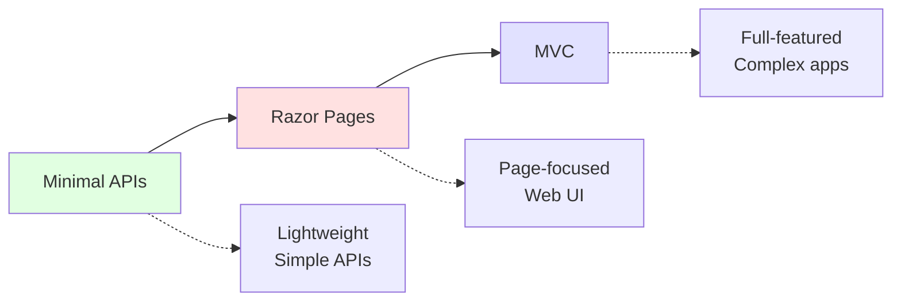
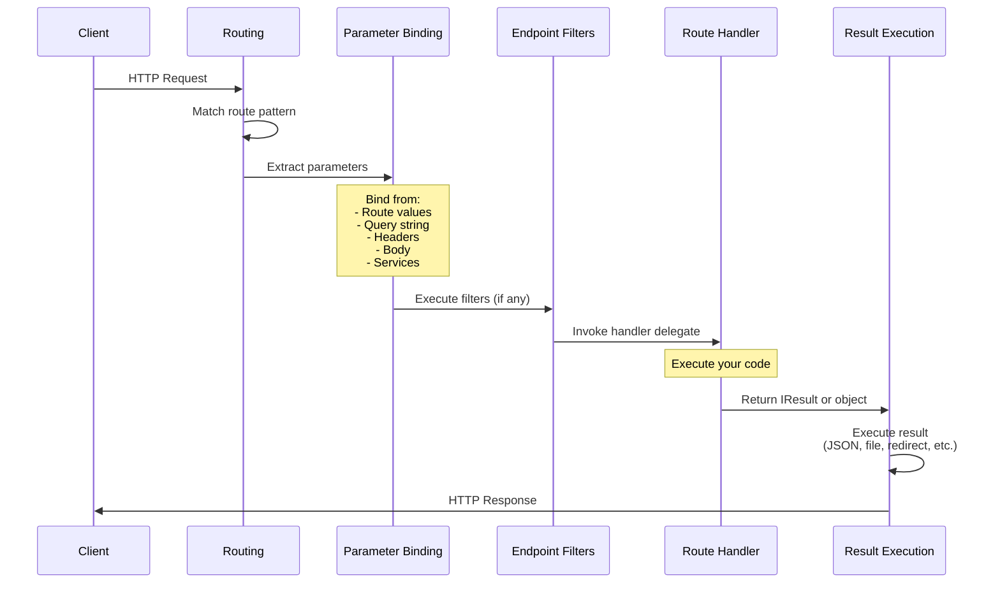
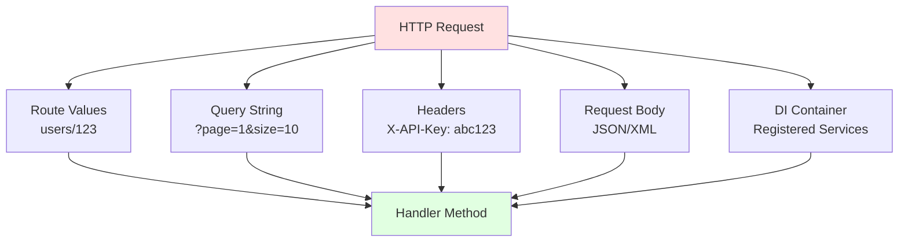
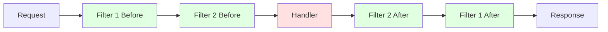
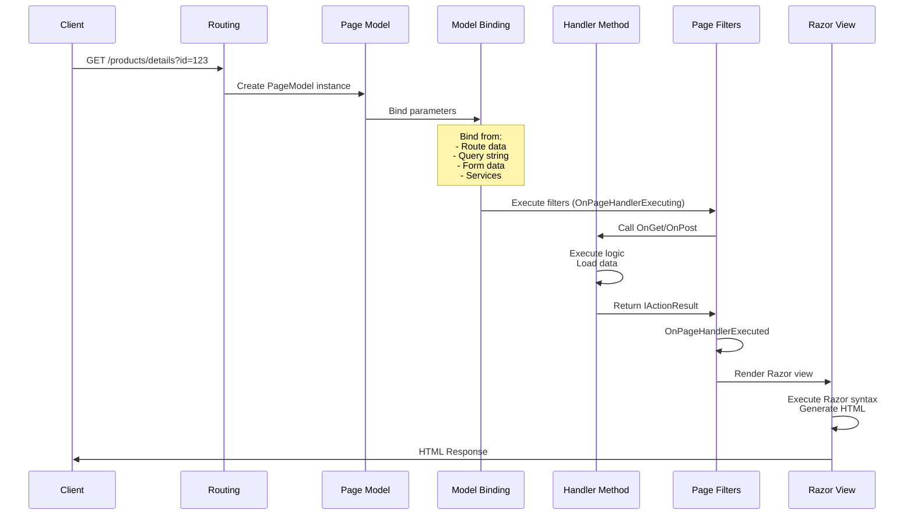
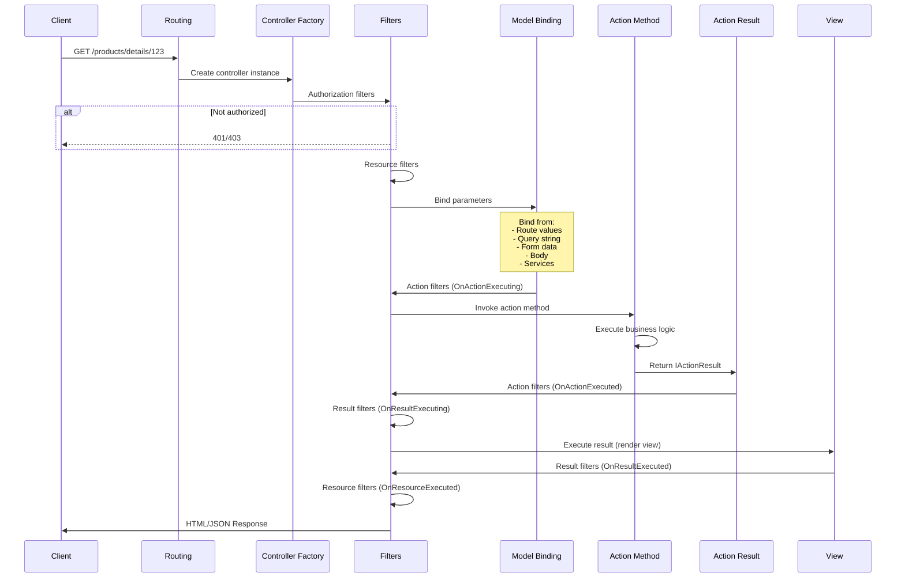
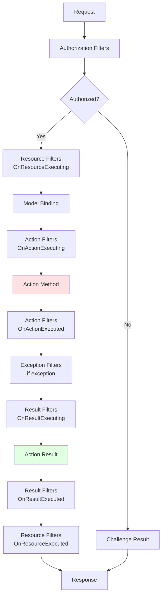

# Understanding the ASP.NET Core Request and Response Pipeline - Part 5: MVC, Razor Pages, and Minimal APIs

## Introduction

We've journeyed through the hosting layer, middleware pipeline, and routing system. Now we arrive at the application layer—where your business logic lives. ASP.NET Core offers three primary programming models for building web applications:

1. **MVC (Model-View-Controller)** - A structured pattern for building complex web applications and APIs
2. **Razor Pages** - A page-based model that simplifies building web UI
3. **Minimal APIs** - A lightweight approach for building HTTP APIs with minimal ceremony

Each model sits atop the same routing and endpoint infrastructure we explored in Part 4, but they provide different developer experiences and are optimized for different scenarios. In this part, we'll explore how each model processes requests and generates responses.

## The Application Model Spectrum



**When to use each:**

- **Minimal APIs**: Microservices, simple APIs, serverless functions, learning ASP.NET Core
- **Razor Pages**: Page-focused web apps, CRUD operations, forms-heavy applications
- **MVC**: Complex web apps, APIs with complex routing, applications requiring clear separation of concerns

All three share the same pipeline but differ in how they organize code and handle requests.

## Minimal APIs: The Lightweight Approach

Minimal APIs were introduced in .NET 6 to simplify API development. They reduce ceremony and boilerplate, making it faster to build HTTP APIs.

### Basic Structure

```csharp
var builder = WebApplication.CreateBuilder(args);

// Add services
builder.Services.AddSingleton<IDataService, DataService>();

var app = builder.Build();

// Define endpoints
app.MapGet("/", () => "Hello World!");

app.MapGet("/users/{id}", (int id) => new User(id, "John Doe"));

app.MapPost("/users", (User user) =>
{
    // Save user
    return Results.Created($"/users/{user.Id}", user);
});

app.Run();

record User(int Id, string Name);
```

### Request Processing Flow



### Parameter Binding in Detail

```csharp
var builder = WebApplication.CreateBuilder(args);
builder.Services.AddSingleton<IEmailService, EmailService>();
var app = builder.Build();

// Simple types from route
app.MapGet("/users/{id}", (int id) =>
    new { userId = id });

// Multiple sources
app.MapGet("/search",
    (string q,                                    // From query string
     int page = 1,                               // From query string with default
     [FromHeader(Name = "X-API-Key")] string apiKey,  // From header
     [FromServices] IEmailService emailService)  // From DI container
    =>
{
    return new
    {
        Query = q,
        Page = page,
        ApiKey = apiKey,
        EmailServiceType = emailService.GetType().Name
    };
});

// Complex type from body
app.MapPost("/users",
    ([FromBody] CreateUserRequest request,
     [FromServices] IUserService userService,
     HttpContext context) =>
{
    var user = userService.CreateUser(request);
    return Results.Created($"/users/{user.Id}", user);
});

// Custom binding with AsParameters
app.MapGet("/products", ([AsParameters] ProductQuery query) =>
{
    // All parameters bundled in one object
    return new { query.Category, query.MinPrice, query.MaxPrice };
});

app.Run();

record CreateUserRequest(string Name, string Email);

// AsParameters allows grouping parameters
record ProductQuery(string? Category, decimal MinPrice = 0, decimal MaxPrice = 1000);

interface IEmailService { }
class EmailService : IEmailService { }
interface IUserService
{
    User CreateUser(CreateUserRequest request);
}
class User
{
    public int Id { get; set; }
}
```

**Binding sources visualization:**



### Results and Responses

Minimal APIs support multiple response types:

```csharp
var app = WebApplication.CreateBuilder().Build();

// 1. Direct return - serialized as JSON
app.MapGet("/users/{id}", (int id) =>
    new User(id, "John Doe", "john@example.com"));

// 2. IResult - typed results
app.MapGet("/ok", () => Results.Ok(new { status = "OK" }));
app.MapGet("/created", () => Results.Created("/users/1", new User(1, "Jane", "jane@example.com")));
app.MapGet("/notfound", () => Results.NotFound());
app.MapGet("/redirect", () => Results.Redirect("/new-location"));
app.MapGet("/file", () => Results.File("file.pdf", "application/pdf"));

// 3. Typed results with Results<T1, T2, ...>
app.MapGet("/typed/{id}", Results<Ok<User>, NotFound> (int id) =>
{
    var user = GetUser(id);
    return user != null
        ? TypedResults.Ok(user)
        : TypedResults.NotFound();
});

// 4. Custom response
app.MapGet("/custom", (HttpContext context) =>
{
    context.Response.StatusCode = 200;
    context.Response.Headers["X-Custom-Header"] = "Value";
    return context.Response.WriteAsync("Custom response");
});

// 5. Stream response
app.MapGet("/stream", async (HttpContext context) =>
{
    context.Response.ContentType = "text/plain";
    await context.Response.StartAsync();

    for (int i = 0; i < 10; i++)
    {
        await context.Response.WriteAsync($"Line {i}\n");
        await context.Response.Body.FlushAsync();
        await Task.Delay(100);
    }
});

app.Run();

record User(int Id, string Name, string Email);

User? GetUser(int id) => id == 1 ? new User(1, "John", "john@example.com") : null;
```

### Endpoint Filters

Filters allow you to execute code before and after the handler:

```csharp
var builder = WebApplication.CreateBuilder(args);
var app = builder.Build();

// Global filter using middleware
app.Use(async (context, next) =>
{
    Console.WriteLine($"Before: {context.Request.Path}");
    await next(context);
    Console.WriteLine($"After: {context.Response.StatusCode}");
});

// Endpoint-specific filter
app.MapGet("/filtered", () => "Hello")
    .AddEndpointFilter(async (context, next) =>
    {
        Console.WriteLine("Before handler");

        var result = await next(context);

        Console.WriteLine("After handler");

        return result;
    });

// Filter with logic
app.MapGet("/validated", (int age) => $"Age: {age}")
    .AddEndpointFilter(async (context, next) =>
    {
        var age = context.GetArgument<int>(0);

        if (age < 0)
        {
            return Results.BadRequest("Age cannot be negative");
        }

        return await next(context);
    });

// Reusable filter
app.MapGet("/timed", () =>
{
    Thread.Sleep(100);
    return "Done";
})
.AddEndpointFilter<TimingFilter>();

app.Run();

// Reusable filter class
class TimingFilter : IEndpointFilter
{
    private readonly ILogger<TimingFilter> _logger;

    public TimingFilter(ILogger<TimingFilter> logger)
    {
        _logger = logger;
    }

    public async ValueTask<object?> InvokeAsync(
        EndpointFilterInvocationContext context,
        EndpointFilterDelegate next)
    {
        var sw = Stopwatch.StartNew();

        var result = await next(context);

        sw.Stop();
        _logger.LogInformation(
            "Endpoint {Endpoint} took {Elapsed}ms",
            context.HttpContext.Request.Path,
            sw.ElapsedMilliseconds);

        return result;
    }
}
```

**Filter pipeline:**



## Razor Pages: Page-Based Web UI

Razor Pages provides a page-focused model that makes building web UI simpler than MVC for many scenarios.

### Structure

```
Pages/
  _ViewImports.cshtml
  _ViewStart.cshtml
  Index.cshtml
  Index.cshtml.cs
  Products/
    List.cshtml
    List.cshtml.cs
    Details.cshtml
    Details.cshtml.cs
```

### Basic Razor Page

**Pages/Index.cshtml:**
```cshtml
@page
@model IndexModel

<h1>Welcome</h1>
<p>Current time: @Model.CurrentTime</p>

<form method="post">
    <input type="text" asp-for="Name" />
    <button type="submit">Submit</button>
</form>

@if (!string.IsNullOrEmpty(Model.Message))
{
    <p>@Model.Message</p>
}
```

**Pages/Index.cshtml.cs:**
```csharp
public class IndexModel : PageModel
{
    [BindProperty]
    public string Name { get; set; } = "";

    public string CurrentTime { get; set; } = "";
    public string Message { get; set; } = "";

    public void OnGet()
    {
        CurrentTime = DateTime.Now.ToString("HH:mm:ss");
    }

    public IActionResult OnPost()
    {
        if (string.IsNullOrWhiteSpace(Name))
        {
            Message = "Please enter a name";
            return Page();
        }

        Message = $"Hello, {Name}!";
        return Page();
    }
}
```

### Request Processing Flow



### Route Parameters

```csharp
// Pages/Products/Details.cshtml.cs
@page "{id:int}"
@model DetailsModel

public class DetailsModel : PageModel
{
    private readonly IProductService _productService;

    public DetailsModel(IProductService productService)
    {
        _productService = productService;
    }

    public Product? Product { get; set; }

    public async Task<IActionResult> OnGetAsync(int id)
    {
        Product = await _productService.GetProductAsync(id);

        if (Product == null)
        {
            return NotFound();
        }

        return Page();
    }
}
```

**URL:** `/products/details/123` → `id = 123`

### Multiple Handlers

```csharp
public class ContactModel : PageModel
{
    [BindProperty]
    public ContactForm Form { get; set; } = new();

    public string Message { get; set; } = "";

    // Default GET handler
    public void OnGet()
    {
    }

    // Default POST handler
    public IActionResult OnPost()
    {
        if (!ModelState.IsValid)
        {
            return Page();
        }

        // Send email
        Message = "Message sent!";
        return Page();
    }

    // Named handler: POST with ?handler=subscribe
    public IActionResult OnPostSubscribe(string email)
    {
        // Subscribe to newsletter
        Message = $"Subscribed: {email}";
        return Page();
    }

    // Named handler: POST with ?handler=unsubscribe
    public IActionResult OnPostUnsubscribe(string email)
    {
        // Unsubscribe
        Message = $"Unsubscribed: {email}";
        return Page();
    }
}

public class ContactForm
{
    [Required]
    public string Name { get; set; } = "";

    [Required, EmailAddress]
    public string Email { get; set; } = "";

    [Required]
    public string Message { get; set; } = "";
}
```

**Usage in Razor:**
```cshtml
@page
@model ContactModel

<!-- Default handler (OnPost) -->
<form method="post">
    <input asp-for="Form.Name" />
    <input asp-for="Form.Email" />
    <textarea asp-for="Form.Message"></textarea>
    <button type="submit">Send</button>
</form>

<!-- Named handler (OnPostSubscribe) -->
<form method="post" asp-page-handler="Subscribe">
    <input type="email" name="email" />
    <button type="submit">Subscribe</button>
</form>

<!-- Named handler (OnPostUnsubscribe) -->
<form method="post" asp-page-handler="Unsubscribe">
    <input type="email" name="email" />
    <button type="submit">Unsubscribe</button>
</form>
```

### Page Filters

```csharp
// Global page filter
public class LoggingPageFilter : IPageFilter
{
    private readonly ILogger<LoggingPageFilter> _logger;

    public LoggingPageFilter(ILogger<LoggingPageFilter> logger)
    {
        _logger = logger;
    }

    public void OnPageHandlerSelected(PageHandlerSelectedContext context)
    {
        _logger.LogInformation(
            "Page handler selected: {HandlerMethod}",
            context.HandlerMethod?.Name);
    }

    public void OnPageHandlerExecuting(PageHandlerExecutingContext context)
    {
        _logger.LogInformation("Page handler executing");
    }

    public void OnPageHandlerExecuted(PageHandlerExecutedContext context)
    {
        _logger.LogInformation(
            "Page handler executed, result: {Result}",
            context.Result?.GetType().Name);
    }
}

// Register globally
var builder = WebApplication.CreateBuilder(args);

builder.Services.AddRazorPages(options =>
{
    options.Conventions.ConfigureFilter(new LoggingPageFilter(
        LoggerFactory.Create(b => b.AddConsole()).CreateLogger<LoggingPageFilter>()
    ));
});

var app = builder.Build();
```

## MVC: The Full-Featured Framework

MVC (Model-View-Controller) provides a structured pattern for building complex applications with clear separation of concerns.

### Structure

```
Controllers/
  HomeController.cs
  ProductsController.cs
  ApiController.cs
Models/
  Product.cs
  CreateProductViewModel.cs
Views/
  Home/
    Index.cshtml
    About.cshtml
  Products/
    List.cshtml
    Details.cshtml
  Shared/
    _Layout.cshtml
    _ValidationScriptsPartial.cshtml
```

### MVC Request Processing Flow



### Basic Controller

```csharp
public class ProductsController : Controller
{
    private readonly IProductService _productService;
    private readonly ILogger<ProductsController> _logger;

    public ProductsController(
        IProductService productService,
        ILogger<ProductsController> logger)
    {
        _productService = productService;
        _logger = logger;
    }

    // GET: /products
    public async Task<IActionResult> Index()
    {
        var products = await _productService.GetAllProductsAsync();
        return View(products);
    }

    // GET: /products/details/5
    public async Task<IActionResult> Details(int id)
    {
        var product = await _productService.GetProductAsync(id);

        if (product == null)
        {
            return NotFound();
        }

        return View(product);
    }

    // GET: /products/create
    public IActionResult Create()
    {
        return View();
    }

    // POST: /products/create
    [HttpPost]
    [ValidateAntiForgeryToken]
    public async Task<IActionResult> Create(CreateProductViewModel model)
    {
        if (!ModelState.IsValid)
        {
            return View(model);
        }

        var product = await _productService.CreateProductAsync(model);

        return RedirectToAction(nameof(Details), new { id = product.Id });
    }

    // DELETE: /products/delete/5
    [HttpPost]
    [ValidateAntiForgeryToken]
    public async Task<IActionResult> Delete(int id)
    {
        await _productService.DeleteProductAsync(id);

        return RedirectToAction(nameof(Index));
    }
}
```

### Action Results

```csharp
public class ResultsController : Controller
{
    // View result
    public IActionResult Index()
    {
        return View(); // Views/Results/Index.cshtml
    }

    // View with model
    public IActionResult Details(int id)
    {
        var model = new Product { Id = id, Name = "Product" };
        return View(model);
    }

    // Specific view
    public IActionResult Custom()
    {
        return View("CustomViewName");
    }

    // JSON result
    public IActionResult GetJson()
    {
        return Json(new { id = 1, name = "Product" });
    }

    // Redirect
    public IActionResult RedirectSample()
    {
        return RedirectToAction("Index", "Home");
    }

    // Redirect to route
    public IActionResult RedirectToRouteSample()
    {
        return RedirectToRoute("Default", new { controller = "Home", action = "Index" });
    }

    // Content result
    public IActionResult GetText()
    {
        return Content("Plain text response", "text/plain");
    }

    // File result
    public IActionResult DownloadFile()
    {
        var bytes = System.IO.File.ReadAllBytes("file.pdf");
        return File(bytes, "application/pdf", "download.pdf");
    }

    // Status code result
    public IActionResult StatusCodeSample()
    {
        return StatusCode(503); // Service Unavailable
    }

    // Not found
    public IActionResult NotFoundSample()
    {
        return NotFound(); // 404
    }

    // Bad request
    public IActionResult BadRequestSample()
    {
        return BadRequest("Invalid input"); // 400
    }

    // Unauthorized
    public IActionResult UnauthorizedSample()
    {
        return Unauthorized(); // 401
    }
}
```

### Model Binding

```csharp
public class BindingController : Controller
{
    // Simple parameter from route
    // Route: products/{id}
    public IActionResult Get(int id)
    {
        return Ok(new { id });
    }

    // Multiple parameters from route and query
    // Route: products/{id}?includeDetails=true
    public IActionResult GetWithDetails(int id, bool includeDetails = false)
    {
        return Ok(new { id, includeDetails });
    }

    // Complex type from form
    [HttpPost]
    public IActionResult CreateFromForm([FromForm] Product product)
    {
        return Ok(product);
    }

    // Complex type from body (JSON)
    [HttpPost]
    public IActionResult CreateFromBody([FromBody] Product product)
    {
        return Ok(product);
    }

    // From header
    public IActionResult HeaderSample([FromHeader(Name = "X-API-Key")] string apiKey)
    {
        return Ok(new { apiKey });
    }

    // From services
    public IActionResult ServiceSample([FromServices] IProductService productService)
    {
        var count = productService.GetCount();
        return Ok(new { count });
    }

    // Custom binding
    public IActionResult CustomBinding([ModelBinder(typeof(CustomBinder))] CustomModel model)
    {
        return Ok(model);
    }
}

// Custom model binder
public class CustomBinder : IModelBinder
{
    public Task BindModelAsync(ModelBindingContext bindingContext)
    {
        var value = bindingContext.ValueProvider.GetValue("custom").FirstValue;

        var model = new CustomModel { Value = value?.ToUpper() ?? "" };

        bindingContext.Result = ModelBindingResult.Success(model);

        return Task.CompletedTask;
    }
}

public class CustomModel
{
    public string Value { get; set; } = "";
}
```

### Action Filters

Filters execute code at different points in the request pipeline:



**Filter types:**

```csharp
// 1. Authorization filter
public class CustomAuthorizeFilter : IAuthorizationFilter
{
    public void OnAuthorization(AuthorizationFilterContext context)
    {
        if (!context.HttpContext.User.Identity?.IsAuthenticated ?? true)
        {
            context.Result = new UnauthorizedResult();
        }
    }
}

// 2. Resource filter
public class CacheResourceFilter : IResourceFilter
{
    private static readonly Dictionary<string, object> _cache = new();

    public void OnResourceExecuting(ResourceExecutingContext context)
    {
        var cacheKey = context.HttpContext.Request.Path;

        if (_cache.TryGetValue(cacheKey, out var cachedResult))
        {
            context.Result = (IActionResult)cachedResult;
            // Short-circuit the pipeline
        }
    }

    public void OnResourceExecuted(ResourceExecutedContext context)
    {
        var cacheKey = context.HttpContext.Request.Path;

        if (context.Result != null)
        {
            _cache[cacheKey] = context.Result;
        }
    }
}

// 3. Action filter
public class LogActionFilter : IActionFilter
{
    private readonly ILogger<LogActionFilter> _logger;

    public LogActionFilter(ILogger<LogActionFilter> logger)
    {
        _logger = logger;
    }

    public void OnActionExecuting(ActionExecutingContext context)
    {
        _logger.LogInformation(
            "Executing action {Action} with arguments: {Arguments}",
            context.ActionDescriptor.DisplayName,
            string.Join(", ", context.ActionArguments.Select(kvp => $"{kvp.Key}={kvp.Value}")));
    }

    public void OnActionExecuted(ActionExecutedContext context)
    {
        _logger.LogInformation(
            "Executed action {Action}, result: {Result}",
            context.ActionDescriptor.DisplayName,
            context.Result?.GetType().Name);
    }
}

// 4. Exception filter
public class CustomExceptionFilter : IExceptionFilter
{
    public void OnException(ExceptionContext context)
    {
        if (context.Exception is ArgumentException)
        {
            context.Result = new BadRequestObjectResult(new
            {
                error = context.Exception.Message
            });

            context.ExceptionHandled = true;
        }
    }
}

// 5. Result filter
public class HeaderResultFilter : IResultFilter
{
    public void OnResultExecuting(ResultExecutingContext context)
    {
        context.HttpContext.Response.Headers["X-Custom-Header"] = "Value";
    }

    public void OnResultExecuted(ResultExecutedContext context)
    {
        // After result execution
    }
}

// Register filters
var builder = WebApplication.CreateBuilder(args);

builder.Services.AddControllersWithViews(options =>
{
    // Global filters
    options.Filters.Add<LogActionFilter>();
    options.Filters.Add<CustomExceptionFilter>();
});

// Or apply to specific controllers/actions
[ServiceFilter(typeof(LogActionFilter))]
public class ProductsController : Controller
{
    [TypeFilter(typeof(CacheResourceFilter))]
    public IActionResult Index()
    {
        return View();
    }
}
```

### API Controllers

```csharp
[ApiController]
[Route("api/[controller]")]
public class ProductsApiController : ControllerBase
{
    private readonly IProductService _productService;

    public ProductsApiController(IProductService productService)
    {
        _productService = productService;
    }

    // GET: api/products
    [HttpGet]
    [ProducesResponseType(typeof(IEnumerable<Product>), 200)]
    public async Task<ActionResult<IEnumerable<Product>>> GetProducts()
    {
        var products = await _productService.GetAllProductsAsync();
        return Ok(products);
    }

    // GET: api/products/5
    [HttpGet("{id}")]
    [ProducesResponseType(typeof(Product), 200)]
    [ProducesResponseType(404)]
    public async Task<ActionResult<Product>> GetProduct(int id)
    {
        var product = await _productService.GetProductAsync(id);

        if (product == null)
        {
            return NotFound();
        }

        return Ok(product);
    }

    // POST: api/products
    [HttpPost]
    [ProducesResponseType(typeof(Product), 201)]
    [ProducesResponseType(400)]
    public async Task<ActionResult<Product>> CreateProduct(CreateProductDto dto)
    {
        if (!ModelState.IsValid)
        {
            return BadRequest(ModelState);
        }

        var product = await _productService.CreateProductAsync(dto);

        return CreatedAtAction(nameof(GetProduct), new { id = product.Id }, product);
    }

    // PUT: api/products/5
    [HttpPut("{id}")]
    [ProducesResponseType(204)]
    [ProducesResponseType(400)]
    [ProducesResponseType(404)]
    public async Task<IActionResult> UpdateProduct(int id, UpdateProductDto dto)
    {
        if (id != dto.Id)
        {
            return BadRequest();
        }

        var exists = await _productService.ExistsAsync(id);
        if (!exists)
        {
            return NotFound();
        }

        await _productService.UpdateProductAsync(dto);

        return NoContent();
    }

    // DELETE: api/products/5
    [HttpDelete("{id}")]
    [ProducesResponseType(204)]
    [ProducesResponseType(404)]
    public async Task<IActionResult> DeleteProduct(int id)
    {
        var exists = await _productService.ExistsAsync(id);
        if (!exists)
        {
            return NotFound();
        }

        await _productService.DeleteProductAsync(id);

        return NoContent();
    }
}
```

## Comparing the Three Models

```mermaid
graph TB
    subgraph "Minimal APIs"
        MA1[Direct Route Registration]
        MA2[Lambda Handlers]
        MA3[Endpoint Filters]
        MA4[Simple Binding]

        MA1 --> MA2
        MA2 --> MA3
        MA3 --> MA4
    end

    subgraph "Razor Pages"
        RP1[Page-Based Routing]
        RP2[PageModel Handlers]
        RP3[Page Filters]
        RP4[Razor View Engine]

        RP1 --> RP2
        RP2 --> RP3
        RP3 --> RP4
    end

    subgraph "MVC"
        MVC1[Controller-Based Routing]
        MVC2[Action Methods]
        MVC3[Multiple Filter Types]
        MVC4[View/JSON Results]

        MVC1 --> MVC2
        MVC2 --> MVC3
        MVC3 --> MVC4
    end

    style MA1 fill:#e1ffe1
    style RP1 fill:#ffe1e1
    style MVC1 fill:#e1e1ff
```



| Feature | Minimal APIs | Razor Pages | MVC |
|---------|--------------|-------------|-----|
| **Complexity** | Low | Medium | High |
| **Boilerplate** | Minimal | Moderate | Significant |
| **Best for** | APIs, microservices | Page-focused web apps | Complex applications |
| **Routing** | Inline | Convention + attributes | Convention + attributes |
| **Separation of concerns** | Low | Medium | High |
| **Testability** | Good | Good | Excellent |
| **Performance** | Fastest | Fast | Fast |
| **Learning curve** | Easiest | Easy | Moderate |

## Key Takeaways

- **Minimal APIs** provide a lightweight, low-ceremony way to build HTTP APIs
- **Razor Pages** simplify page-focused web development with a page-centric model
- **MVC** offers full-featured framework with clear separation of concerns
- All three models use the same underlying routing and endpoint infrastructure
- Parameter binding works similarly across all models
- Filters provide cross-cutting concerns at different pipeline stages
- Choose the model based on your application's complexity and requirements
- You can mix models in the same application

Each programming model provides a different developer experience while leveraging the same powerful ASP.NET Core pipeline. Understanding all three helps you choose the right tool for each scenario.

---

*Continue to Part 6: Advanced Pipeline Hooks and Extensibility to learn about advanced extension points and customization techniques.*
