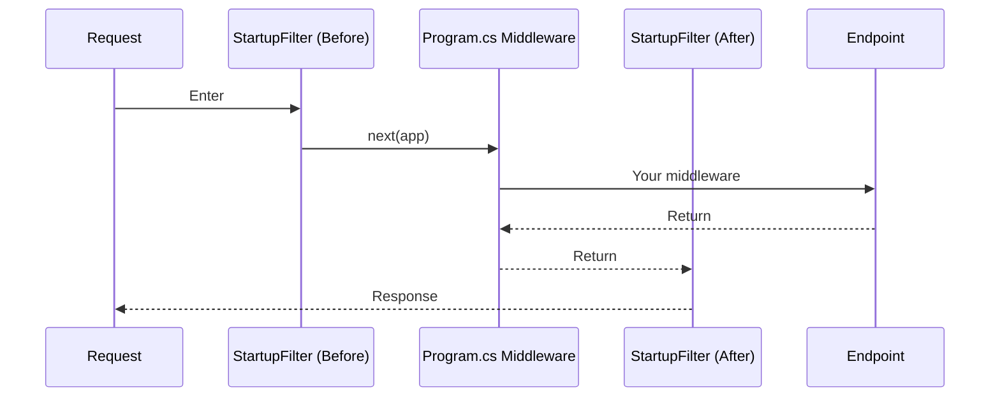
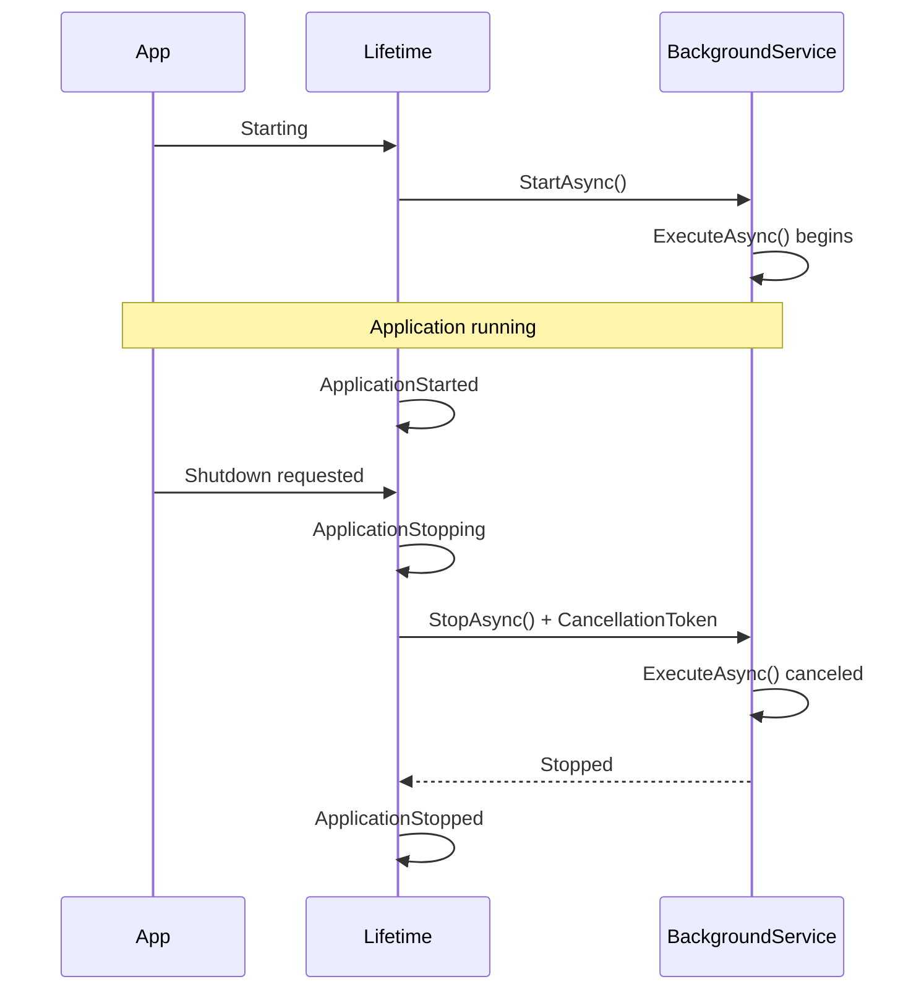
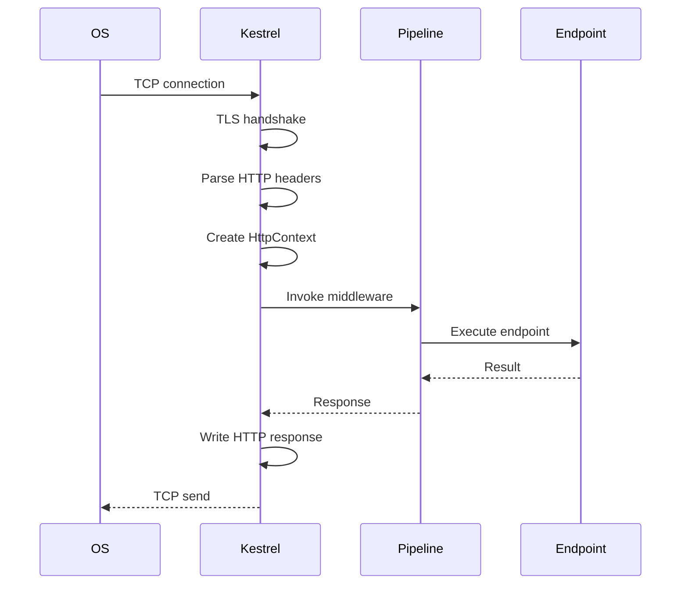
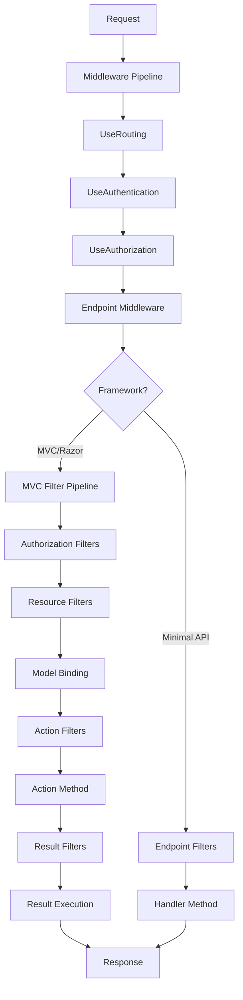

# Understanding the ASP.NET Core Pipeline - Part 6: Advanced Hooks (When You Need More Control)

<!--category-- AI-Article, ASP.NET Core Series, ASP.NET Core, C#, Advanced, IStartupFilter, IHostedService -->
<datetime class="hidden">2024-11-08T05:00</datetime>

> **AI GENERATED** - If that offends you, please stop reading.

# Introduction

You know the pipeline. You understand middleware, routing, and application models. But sometimes you need to hook into the system at a DEEPER level.

That's where these advanced extension points come in:
- `IStartupFilter` - Modify the pipeline before app configuration
- `IHostedService` - Run background tasks
- Custom endpoint data sources - Dynamic routing

Most developers never need these. But when you DO need them, they're invaluable.

[TOC]

# The Problem

Standard middleware and configuration cover 95% of cases. But sometimes you need to:

- Add middleware BEFORE the app's normal configuration
- Run background tasks alongside the web app
- Create endpoints dynamically at runtime
- Hook into application lifetime events

These are the scenarios where standard approaches don't cut it.

**THESE ARE POWER TOOLS - USE RESPONSIBLY**

# IStartupFilter - Modifying the Pipeline Early

`IStartupFilter` lets you configure middleware BEFORE or AFTER the application's normal `Program.cs` configuration.

## Basic Example

```csharp
public class TimingStartupFilter : IStartupFilter
{
    public Action<IApplicationBuilder> Configure(Action<IApplicationBuilder> next)
    {
        return app =>
        {
            // This runs BEFORE your Program.cs middleware
            app.Use(async (context, next) =>
            {
                var sw = Stopwatch.StartNew();
                context.Items["StartTime"] = DateTime.UtcNow;

                await next(context);

                sw.Stop();
                context.Response.Headers["X-Response-Time-Ms"] = sw.ElapsedMilliseconds.ToString();
            });

            // Call the app's configuration
            next(app);

            // This runs AFTER your Program.cs middleware
            app.Use(async (context, next) =>
            {
                context.Response.Headers["X-Pipeline-Complete"] = "true";
                await next(context);
            });
        };
    }
}

// Register it
var builder = WebApplication.CreateBuilder(args);
builder.Services.AddSingleton<IStartupFilter, TimingStartupFilter>();

var app = builder.Build();

app.MapGet("/", () => "Hello");

app.Run();
```

**Execution order:**


WHY use this instead of regular middleware? Because `IStartupFilter` runs NO MATTER WHAT. Even if someone forgets to add your middleware in `Program.cs`, it still runs.

## Real-World Example: Enforce HTTPS

```csharp
public class HttpsEnforcementStartupFilter : IStartupFilter
{
    private readonly IWebHostEnvironment _env;

    public HttpsEnforcementStartupFilter(IWebHostEnvironment env)
    {
        _env = env;
    }

    public Action<IApplicationBuilder> Configure(Action<IApplicationBuilder> next)
    {
        return app =>
        {
            if (_env.IsProduction())
            {
                // Enforce HTTPS in production
                app.Use(async (context, next) =>
                {
                    if (!context.Request.IsHttps)
                    {
                        var https = $"https://{context.Request.Host}{context.Request.Path}{context.Request.QueryString}";
                        context.Response.Redirect(https, permanent: true);
                        return;
                    }

                    await next(context);
                });

                app.UseHsts();
            }

            next(app);
        };
    }
}
```

Register it once, forget about it. Every app in production gets HTTPS enforcement automatically.

# IHostedService - Background Tasks

`IHostedService` lets you run tasks for the lifetime of the application. Perfect for background work.

## Basic Example

```csharp
public class TimedBackgroundService : IHostedService, IDisposable
{
    private readonly ILogger<TimedBackgroundService> _logger;
    private Timer? _timer;

    public TimedBackgroundService(ILogger<TimedBackgroundService> logger)
    {
        _logger = logger;
    }

    public Task StartAsync(CancellationToken cancellationToken)
    {
        _logger.LogInformation("Timed Background Service starting");

        _timer = new Timer(DoWork, null, TimeSpan.Zero, TimeSpan.FromMinutes(5));

        return Task.CompletedTask;
    }

    private void DoWork(object? state)
    {
        _logger.LogInformation("Timed Background Service working");
        // Do your background work here
    }

    public Task StopAsync(CancellationToken cancellationToken)
    {
        _logger.LogInformation("Timed Background Service stopping");

        _timer?.Change(Timeout.Infinite, 0);

        return Task.CompletedTask;
    }

    public void Dispose()
    {
        _timer?.Dispose();
    }
}

// Register it
builder.Services.AddHostedService<TimedBackgroundService>();
```

## BackgroundService - The Easy Way

`BackgroundService` is a simpler base class:

```csharp
public class QueueProcessorService : BackgroundService
{
    private readonly ILogger<QueueProcessorService> _logger;
    private readonly IServiceProvider _serviceProvider;

    public QueueProcessorService(
        ILogger<QueueProcessorService> logger,
        IServiceProvider serviceProvider)
    {
        _logger = logger;
        _serviceProvider = serviceProvider;
    }

    protected override async Task ExecuteAsync(CancellationToken stoppingToken)
    {
        _logger.LogInformation("Queue Processor starting");

        while (!stoppingToken.IsCancellationRequested)
        {
            try
            {
                // Create a scope for scoped services
                using var scope = _serviceProvider.CreateScope();
                var queueService = scope.ServiceProvider.GetRequiredService<IQueueService>();

                var message = await queueService.DequeueAsync(stoppingToken);

                if (message != null)
                {
                    _logger.LogInformation("Processing message: {Message}", message);
                    await queueService.ProcessAsync(message, stoppingToken);
                }

                await Task.Delay(TimeSpan.FromSeconds(1), stoppingToken);
            }
            catch (OperationCanceledException)
            {
                break; // Shutdown requested
            }
            catch (Exception ex)
            {
                _logger.LogError(ex, "Error processing queue");
                await Task.Delay(TimeSpan.FromSeconds(5), stoppingToken);
            }
        }

        _logger.LogInformation("Queue Processor stopping");
    }
}
```

**IMPORTANT**: Background services run in a SINGLETON scope. To use scoped services (like DbContext), create a scope manually.

## Coordinating with Application Lifetime

```csharp
public class StartupTasksService : BackgroundService
{
    private readonly ILogger<StartupTasksService> _logger;
    private readonly IHostApplicationLifetime _lifetime;
    private readonly IServiceProvider _serviceProvider;

    public StartupTasksService(
        ILogger<StartupTasksService> logger,
        IHostApplicationLifetime lifetime,
        IServiceProvider serviceProvider)
    {
        _logger = logger;
        _lifetime = lifetime;
        _serviceProvider = serviceProvider;
    }

    protected override async Task ExecuteAsync(CancellationToken stoppingToken)
    {
        try
        {
            using var scope = _serviceProvider.CreateScope();

            // Run startup tasks
            _logger.LogInformation("Warming up cache...");
            await Task.Delay(500, stoppingToken); // Simulate work

            _logger.LogInformation("Validating database...");
            await Task.Delay(300, stoppingToken);

            _logger.LogInformation("Startup complete");
        }
        catch (Exception ex)
        {
            _logger.LogCritical(ex, "Startup failed");

            // Stop the application if startup fails
            _lifetime.StopApplication();
            return;
        }

        // Continue running
        await Task.Delay(Timeout.Infinite, stoppingToken);
    }
}
```

**Lifecycle:**



# Application Lifetime Events

Hook into lifecycle events:

```csharp
var builder = WebApplication.CreateBuilder(args);
var app = builder.Build();

var lifetime = app.Services.GetRequiredService<IHostApplicationLifetime>();

lifetime.ApplicationStarted.Register(() =>
{
    Console.WriteLine("Application has started");
    // Warm up caches, connections, etc.
});

lifetime.ApplicationStopping.Register(() =>
{
    Console.WriteLine("Shutdown requested");
    // Stop accepting new work
});

lifetime.ApplicationStopped.Register(() =>
{
    Console.WriteLine("Application stopped");
    // Final cleanup
});

app.Run();
```

# How Program.cs Order Impacts Everything

The order of configuration in `Program.cs` MATTERS. Here's the full picture:

```csharp
var builder = WebApplication.CreateBuilder(args);

// PHASE 1: Service Registration (order doesn't matter much here)
builder.Services.AddControllers();
builder.Services.AddRazorPages();
builder.Services.AddAuthentication();
builder.Services.AddAuthorization();
builder.Services.AddResponseCaching();
builder.Services.AddResponseCompression();

// Register startup filters (run before app.Build())
builder.Services.AddSingleton<IStartupFilter, MyStartupFilter>();

// Register hosted services
builder.Services.AddHostedService<MyBackgroundService>();

var app = builder.Build();

// PHASE 2: Middleware Configuration (ORDER CRITICAL!)

// 1. FIRST - Exception handler
if (app.Environment.IsDevelopment())
{
    app.UseDeveloperExceptionPage();
}
else
{
    app.UseExceptionHandler("/error");
    app.UseHsts();
}

// 2. HTTPS redirection
app.UseHttpsRedirection();

// 3. Static files (can short-circuit)
app.UseStaticFiles();

// 4. Routing (MATCHES endpoints)
app.UseRouting();

// 5. CORS (after routing, knows which endpoint)
app.UseCors();

// 6. Authentication (WHO are you?)
app.UseAuthentication();

// 7. Authorization (WHAT can you do?)
app.UseAuthorization();

// 8. Response caching
app.UseResponseCaching();

// 9. Response compression
app.UseResponseCompression();

// 10. Custom middleware
app.UseMiddleware<RequestTimingMiddleware>();

// 11. LAST - Map endpoints (EXECUTES endpoints)
app.MapControllers();
app.MapRazorPages();
app.MapGet("/", () => "Hello");

// PHASE 3: Run the application
app.Run(); // Blocks until shutdown
```

**What happens internally:**

```mermaid
graph TD
    A[WebApplication.CreateBuilder] --> B[Load Configuration]
    B --> C[Setup Logging]
    C --> D[Setup DI Container]
    D --> E[Configure Kestrel]

    E --> F[Service Registration Phase]
    F --> G[app.Build()]

    G --> H[IStartupFilter.Configure]
    H --> I[Build Service Provider]
    I --> J[Start IHostedServices]

    J --> K[Middleware Configuration]
    K --> L[app.Run]

    L --> M[Kestrel.Start]
    M --> N[Listen on configured ports]
    N --> O[Process requests through pipeline]

    O --> P[Shutdown signal]
    P --> Q[Stop IHostedServices]
    Q --> R[Dispose services]
    R --> S[Exit]
```

# Kestrel Internals - What Actually Happens

When a request arrives, here's what Kestrel does:

1. **TCP connection accepted** - OS passes socket to Kestrel
2. **Protocol negotiation** - HTTP/1.1, HTTP/2, or HTTP/3?
3. **TLS handshake** (if HTTPS) - Certificate exchange, encryption setup
4. **HTTP parsing** - Parse request line, headers, body
5. **HttpContext creation** - Create `HttpContext` object
6. **Invoke middleware** - Call first middleware's `InvokeAsync`
7. **Response writing** - Write status, headers, body
8. **Connection management** - Keep-alive or close

**Simplified flow:**



# Filters and Their Relationship to the Pipeline

Filters (in MVC/Razor Pages) run WITHIN the endpoint execution phase:



Filters are INSIDE the endpoint - they're not middleware. They run AFTER routing, auth, and authorization.

# In Conclusion

These advanced hooks give you deep control over ASP.NET Core:

- **IStartupFilter** - Wrap the entire pipeline configuration
- **IHostedService** - Run background tasks
- **Application lifetime events** - Hook into startup/shutdown
- **Program.cs order** - CRITICAL for correct behavior
- **Kestrel internals** - Understand what happens before your code runs
- **Filters** - Run inside endpoint execution, not in the middleware pipeline

Most apps don't need these. But when you do, they're powerful.

## The Complete Picture

Putting it all together:

```
OS Network Stack
    ↓
Kestrel (HTTP parsing, TLS)
    ↓
Host (DI, Configuration, Logging)
    ↓
IStartupFilter (before)
    ↓
Exception Handler Middleware
    ↓
HTTPS Redirection Middleware
    ↓
Static Files Middleware
    ↓
Routing Middleware (matches endpoint)
    ↓
CORS Middleware
    ↓
Authentication Middleware
    ↓
Authorization Middleware
    ↓
Custom Middleware
    ↓
IStartupFilter (after)
    ↓
Endpoint Middleware
    ↓
[If Minimal API]
    → Endpoint Filters
    → Handler Method

[If MVC/Razor]
    → Authorization Filters
    → Resource Filters
    → Model Binding
    → Action Filters
    → Action Method
    → Result Filters
    → Result Execution
    ↓
Response (flows back through middleware)
    ↓
Kestrel (writes HTTP response)
    ↓
OS Network Stack
    ↓
Client
```

That's the ENTIRE ASP.NET Core request/response pipeline. Every layer, every hook, every extension point.

---

## Series Conclusion

We've covered the complete ASP.NET Core pipeline:

- **Part 1**: Overview and foundation
- **Part 2**: Kestrel and hosting
- **Part 3**: Middleware
- **Part 4**: Routing
- **Part 5**: Application models
- **Part 6**: Advanced hooks

You now understand how requests flow from network packets to your code and back. Use this knowledge to build better, faster, more maintainable applications.

The pipeline isn't magic - it's just well-designed software. And now you know how it works.

Now go build something great!
