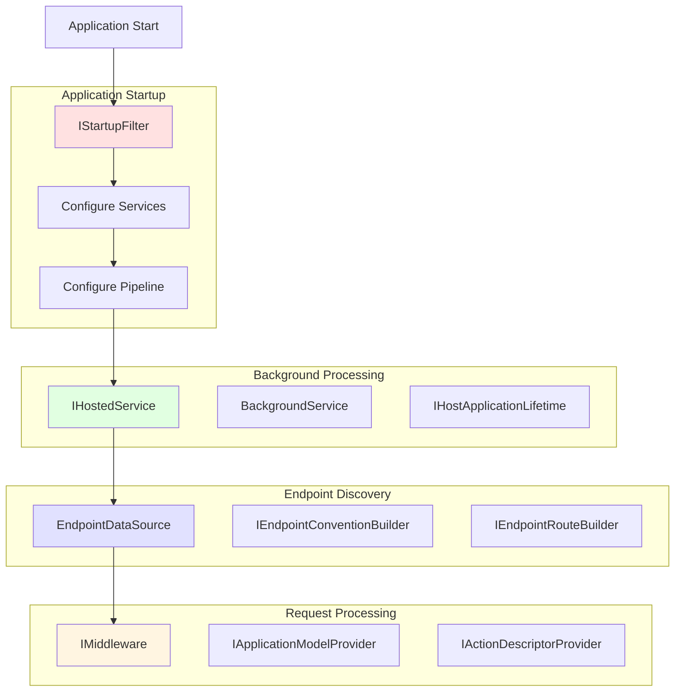
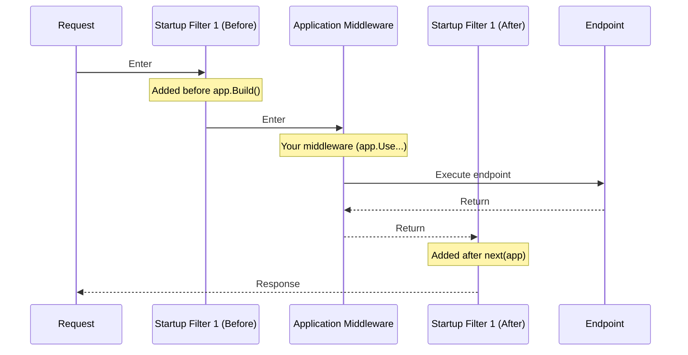
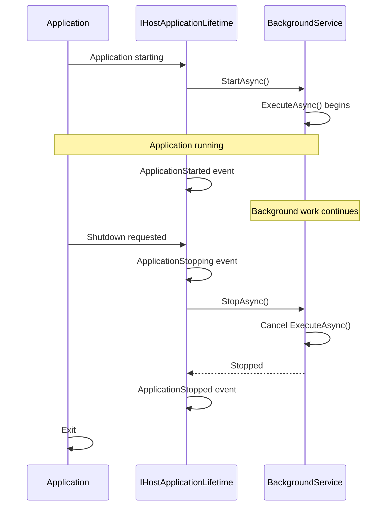

# Understanding the ASP.NET Core Request and Response Pipeline - Part 6: Advanced Pipeline Hooks and Extensibility

## Introduction

Throughout this series, we've explored the ASP.NET Core pipeline from its foundations to application models. Now we'll venture into advanced territory: the extension points and hooks that let you customize the pipeline at a deep level.

These advanced techniques allow you to:
- Modify the pipeline before the application starts
- Add background services that run alongside your application
- Create custom endpoint data sources
- Hook into application lifetime events
- Build reusable components that integrate seamlessly with ASP.NET Core

Understanding these extension points transforms you from a consumer of the framework to someone who can extend it to meet unique requirements.

## Extension Points Overview



## IStartupFilter: Modifying the Pipeline at Startup

`IStartupFilter` allows you to configure middleware before or after the application's normal configuration.

### Basic Usage

```csharp
public class RequestTimingStartupFilter : IStartupFilter
{
    public Action<IApplicationBuilder> Configure(Action<IApplicationBuilder> next)
    {
        return app =>
        {
            // This middleware runs BEFORE your normal pipeline configuration
            app.Use(async (context, next) =>
            {
                var sw = Stopwatch.StartNew();
                context.Items["RequestStartTime"] = DateTime.UtcNow;

                await next(context);

                sw.Stop();
                context.Response.Headers["X-Response-Time-Ms"] = sw.ElapsedMilliseconds.ToString();
            });

            // Call the next startup filter
            next(app);

            // This middleware runs AFTER your normal pipeline configuration
            app.Use(async (context, next) =>
            {
                context.Response.Headers["X-Pipeline-End"] = "true";
                await next(context);
            });
        };
    }
}

// Register the startup filter
var builder = WebApplication.CreateBuilder(args);

builder.Services.AddSingleton<IStartupFilter, RequestTimingStartupFilter>();

var app = builder.Build();

app.MapGet("/", () => "Hello World!");

app.Run();
```

**Execution order:**



### Practical Example: Auto-HTTPS Enforcement

```csharp
public class HttpsEnforcementStartupFilter : IStartupFilter
{
    private readonly IWebHostEnvironment _env;

    public HttpsEnforcementStartupFilter(IWebHostEnvironment env)
    {
        _env = env;
    }

    public Action<IApplicationBuilder> Configure(Action<IApplicationBuilder> next)
    {
        return app =>
        {
            // Only enforce HTTPS in production
            if (_env.IsProduction())
            {
                app.Use(async (context, next) =>
                {
                    if (!context.Request.IsHttps)
                    {
                        var httpsUrl = $"https://{context.Request.Host}{context.Request.Path}{context.Request.QueryString}";
                        context.Response.Redirect(httpsUrl, permanent: true);
                        return;
                    }

                    await next(context);
                });

                // Add HSTS header
                app.UseHsts();
            }

            next(app);
        };
    }
}
```

### Composing Multiple Startup Filters

```csharp
// Filter 1: Logging
public class LoggingStartupFilter : IStartupFilter
{
    public Action<IApplicationBuilder> Configure(Action<IApplicationBuilder> next)
    {
        return app =>
        {
            app.Use(async (context, next) =>
            {
                Console.WriteLine($"[LoggingFilter] Before: {context.Request.Path}");
                await next(context);
                Console.WriteLine($"[LoggingFilter] After: {context.Response.StatusCode}");
            });

            next(app);
        };
    }
}

// Filter 2: Security headers
public class SecurityHeadersStartupFilter : IStartupFilter
{
    public Action<IApplicationBuilder> Configure(Action<IApplicationBuilder> next)
    {
        return app =>
        {
            app.Use(async (context, next) =>
            {
                context.Response.Headers["X-Content-Type-Options"] = "nosniff";
                context.Response.Headers["X-Frame-Options"] = "DENY";
                context.Response.Headers["X-XSS-Protection"] = "1; mode=block";

                await next(context);
            });

            next(app);
        };
    }
}

// Register both filters
var builder = WebApplication.CreateBuilder(args);

builder.Services.AddSingleton<IStartupFilter, LoggingStartupFilter>();
builder.Services.AddSingleton<IStartupFilter, SecurityHeadersStartupFilter>();

var app = builder.Build();

// Filters execute in registration order
```

## IHostedService: Background Tasks

`IHostedService` enables background tasks that run for the lifetime of the application.

### Basic Hosted Service

```csharp
public class TimedHostedService : IHostedService, IDisposable
{
    private readonly ILogger<TimedHostedService> _logger;
    private Timer? _timer;
    private int _executionCount = 0;

    public TimedHostedService(ILogger<TimedHostedService> logger)
    {
        _logger = logger;
    }

    public Task StartAsync(CancellationToken cancellationToken)
    {
        _logger.LogInformation("Timed Hosted Service is starting");

        _timer = new Timer(DoWork, null, TimeSpan.Zero, TimeSpan.FromSeconds(5));

        return Task.CompletedTask;
    }

    private void DoWork(object? state)
    {
        var count = Interlocked.Increment(ref _executionCount);

        _logger.LogInformation(
            "Timed Hosted Service is working. Count: {Count}",
            count);
    }

    public Task StopAsync(CancellationToken cancellationToken)
    {
        _logger.LogInformation("Timed Hosted Service is stopping");

        _timer?.Change(Timeout.Infinite, 0);

        return Task.CompletedTask;
    }

    public void Dispose()
    {
        _timer?.Dispose();
    }
}

// Register
var builder = WebApplication.CreateBuilder(args);
builder.Services.AddHostedService<TimedHostedService>();
var app = builder.Build();
```

### BackgroundService: Simplified Background Tasks

```csharp
public class QueueProcessorService : BackgroundService
{
    private readonly ILogger<QueueProcessorService> _logger;
    private readonly IServiceProvider _serviceProvider;

    public QueueProcessorService(
        ILogger<QueueProcessorService> logger,
        IServiceProvider serviceProvider)
    {
        _logger = logger;
        _serviceProvider = serviceProvider;
    }

    protected override async Task ExecuteAsync(CancellationToken stoppingToken)
    {
        _logger.LogInformation("Queue Processor Service is starting");

        // Run until cancellation is requested
        while (!stoppingToken.IsCancellationRequested)
        {
            try
            {
                await ProcessQueueAsync(stoppingToken);

                // Wait before next iteration
                await Task.Delay(TimeSpan.FromSeconds(1), stoppingToken);
            }
            catch (OperationCanceledException)
            {
                // Expected when stopping
                break;
            }
            catch (Exception ex)
            {
                _logger.LogError(ex, "Error processing queue");

                // Wait before retrying
                await Task.Delay(TimeSpan.FromSeconds(5), stoppingToken);
            }
        }

        _logger.LogInformation("Queue Processor Service is stopping");
    }

    private async Task ProcessQueueAsync(CancellationToken cancellationToken)
    {
        // Create a scope for scoped services
        using var scope = _serviceProvider.CreateScope();
        var queueService = scope.ServiceProvider.GetRequiredService<IQueueService>();

        var item = await queueService.DequeueAsync(cancellationToken);

        if (item != null)
        {
            _logger.LogInformation("Processing item: {Item}", item);
            await queueService.ProcessAsync(item, cancellationToken);
        }
    }
}
```

### Coordinating with Application Lifetime

```csharp
public class StartupTasksService : BackgroundService
{
    private readonly ILogger<StartupTasksService> _logger;
    private readonly IHostApplicationLifetime _lifetime;
    private readonly IServiceProvider _serviceProvider;

    public StartupTasksService(
        ILogger<StartupTasksService> logger,
        IHostApplicationLifetime lifetime,
        IServiceProvider serviceProvider)
    {
        _logger = logger;
        _lifetime = lifetime;
        _serviceProvider = serviceProvider;
    }

    protected override async Task ExecuteAsync(CancellationToken stoppingToken)
    {
        // Wait for application to fully start
        await Task.Delay(100, stoppingToken);

        try
        {
            using var scope = _serviceProvider.CreateScope();

            // Run startup tasks
            await WarmUpCacheAsync(scope, stoppingToken);
            await ValidateDatabaseAsync(scope, stoppingToken);
            await LoadConfigurationAsync(scope, stoppingToken);

            _logger.LogInformation("All startup tasks completed successfully");
        }
        catch (Exception ex)
        {
            _logger.LogCritical(ex, "Startup tasks failed");

            // Stop the application if startup tasks fail
            _lifetime.StopApplication();
            return;
        }

        // Continue running for the lifetime of the application
        await Task.Delay(Timeout.Infinite, stoppingToken);
    }

    private async Task WarmUpCacheAsync(IServiceScopeScope, CancellationToken cancellationToken)
    {
        _logger.LogInformation("Warming up cache...");
        await Task.Delay(500, cancellationToken);
        _logger.LogInformation("Cache warmed up");
    }

    private async Task ValidateDatabaseAsync(IServiceScope scope, CancellationToken cancellationToken)
    {
        _logger.LogInformation("Validating database...");
        await Task.Delay(300, cancellationToken);
        _logger.LogInformation("Database validated");
    }

    private async Task LoadConfigurationAsync(IServiceScope scope, CancellationToken cancellationToken)
    {
        _logger.LogInformation("Loading configuration...");
        await Task.Delay(200, cancellationToken);
        _logger.LogInformation("Configuration loaded");
    }
}
```

**Lifecycle visualization:**



## Custom Endpoint Data Sources

Create dynamic endpoints that are discovered at runtime:

```csharp
public class PluginEndpointDataSource : EndpointDataSource
{
    private readonly List<Endpoint> _endpoints = new();
    private readonly IChangeToken _changeToken = NullChangeToken.Singleton;

    public PluginEndpointDataSource()
    {
        // Discover plugins and create endpoints
        DiscoverPlugins();
    }

    public override IReadOnlyList<Endpoint> Endpoints => _endpoints;

    public override IChangeToken GetChangeToken() => _changeToken;

    private void DiscoverPlugins()
    {
        // Example: Create endpoints for each discovered plugin
        var plugins = new[]
        {
            new { Name = "Plugin1", Path = "/plugins/plugin1" },
            new { Name = "Plugin2", Path = "/plugins/plugin2" }
        };

        foreach (var plugin in plugins)
        {
            var requestDelegate = CreatePluginDelegate(plugin.Name);

            var routeEndpoint = new RouteEndpoint(
                requestDelegate,
                RoutePatternFactory.Parse(plugin.Path),
                order: 0,
                new EndpointMetadataCollection(
                    new DisplayNameMetadata(plugin.Name)),
                displayName: plugin.Name);

            _endpoints.Add(routeEndpoint);
        }
    }

    private RequestDelegate CreatePluginDelegate(string pluginName)
    {
        return async context =>
        {
            await context.Response.WriteAsJsonAsync(new
            {
                plugin = pluginName,
                message = $"Response from {pluginName}",
                timestamp = DateTime.UtcNow
            });
        };
    }
}

// Register the endpoint data source
var builder = WebApplication.CreateBuilder(args);

builder.Services.AddSingleton<EndpointDataSource, PluginEndpointDataSource>();

var app = builder.Build();

// Endpoints from PluginEndpointDataSource are automatically available

app.Run();
```

### Dynamic Endpoint Generation

```csharp
public class DatabaseEndpointDataSource : EndpointDataSource
{
    private readonly List<Endpoint> _endpoints = new();
    private CancellationTokenSource _cts = new();
    private IChangeToken _changeToken;

    public DatabaseEndpointDataSource(IServiceProvider serviceProvider)
    {
        _changeToken = new CancellationChangeToken(_cts.Token);

        // Load endpoints from database
        LoadEndpointsFromDatabase(serviceProvider);

        // Set up periodic refresh
        Task.Run(async () =>
        {
            while (true)
            {
                await Task.Delay(TimeSpan.FromMinutes(5));
                ReloadEndpoints(serviceProvider);
            }
        });
    }

    public override IReadOnlyList<Endpoint> Endpoints => _endpoints;

    public override IChangeToken GetChangeToken() => _changeToken;

    private void LoadEndpointsFromDatabase(IServiceProvider serviceProvider)
    {
        using var scope = serviceProvider.CreateScope();

        // Simulate loading from database
        var routes = new[]
        {
            new { Path = "/dynamic/users", Handler = "GetUsers" },
            new { Path = "/dynamic/products", Handler = "GetProducts" }
        };

        _endpoints.Clear();

        foreach (var route in routes)
        {
            var requestDelegate = CreateDynamicDelegate(route.Handler);

            var endpoint = new RouteEndpoint(
                requestDelegate,
                RoutePatternFactory.Parse(route.Path),
                order: 0,
                new EndpointMetadataCollection(),
                displayName: route.Handler);

            _endpoints.Add(endpoint);
        }
    }

    private void ReloadEndpoints(IServiceProvider serviceProvider)
    {
        LoadEndpointsFromDatabase(serviceProvider);

        // Notify of changes
        var oldCts = _cts;
        _cts = new CancellationTokenSource();
        _changeToken = new CancellationChangeToken(_cts.Token);
        oldCts.Cancel();
    }

    private RequestDelegate CreateDynamicDelegate(string handler)
    {
        return async context =>
        {
            await context.Response.WriteAsJsonAsync(new
            {
                handler,
                message = $"Dynamic endpoint: {handler}",
                path = context.Request.Path.Value
            });
        };
    }
}
```

## IMiddleware: Class-Based Middleware with DI

Unlike convention-based middleware, `IMiddleware` fully supports dependency injection:

```csharp
public class DatabaseHealthCheckMiddleware : IMiddleware
{
    private readonly ILogger<DatabaseHealthCheckMiddleware> _logger;

    // Can inject scoped services
    public DatabaseHealthCheckMiddleware(ILogger<DatabaseHealthCheckMiddleware> logger)
    {
        _logger = logger;
    }

    public async Task InvokeAsync(HttpContext context, RequestDelegate next)
    {
        if (context.Request.Path == "/health/db")
        {
            // Can resolve scoped services from context
            var dbContext = context.RequestServices.GetRequiredService<MyDbContext>();

            try
            {
                await dbContext.Database.CanConnectAsync();

                context.Response.StatusCode = 200;
                await context.Response.WriteAsJsonAsync(new
                {
                    status = "healthy",
                    database = "connected",
                    timestamp = DateTime.UtcNow
                });
            }
            catch (Exception ex)
            {
                _logger.LogError(ex, "Database health check failed");

                context.Response.StatusCode = 503;
                await context.Response.WriteAsJsonAsync(new
                {
                    status = "unhealthy",
                    database = "disconnected",
                    error = ex.Message
                });
            }

            return;
        }

        await next(context);
    }
}

// Register
var builder = WebApplication.CreateBuilder(args);

builder.Services.AddScoped<DatabaseHealthCheckMiddleware>();

var app = builder.Build();

app.UseMiddleware<DatabaseHealthCheckMiddleware>();

app.Run();
```

## Application Model Providers

Customize how MVC discovers and configures controllers and actions:

```csharp
public class CustomApplicationModelProvider : IApplicationModelProvider
{
    public int Order => -1000 + 10; // Run after default provider

    public void OnProvidersExecuting(ApplicationModelProviderContext context)
    {
        // Runs before the default provider
        foreach (var controller in context.Result.Controllers)
        {
            // Add custom route prefix to all controllers
            controller.Selectors.Add(new SelectorModel
            {
                AttributeRouteModel = new AttributeRouteModel
                {
                    Template = "api/v2/[controller]"
                }
            });
        }
    }

    public void OnProvidersExecuted(ApplicationModelProviderContext context)
    {
        // Runs after the default provider
        foreach (var controller in context.Result.Controllers)
        {
            // Add custom metadata to all actions
            foreach (var action in controller.Actions)
            {
                action.Properties["CustomProperty"] = "CustomValue";
            }
        }
    }
}

// Register
var builder = WebApplication.CreateBuilder(args);

builder.Services.AddControllersWithViews(options =>
{
    options.ModelMetadataDetailsProviders.Add(
        new CustomApplicationModelProvider());
});
```

## Action Descriptor Providers

Dynamically add or modify action descriptors:

```csharp
public class DynamicActionDescriptorProvider : IActionDescriptorProvider
{
    public int Order => -1000; // Run early

    public void OnProvidersExecuting(ActionDescriptorProviderContext context)
    {
        // Add dynamic actions
        context.Results.Add(new ActionDescriptor
        {
            RouteValues = new Dictionary<string, string>
            {
                ["controller"] = "Dynamic",
                ["action"] = "Generated"
            },
            DisplayName = "Dynamic Generated Action",
            AttributeRouteInfo = new AttributeRouteInfo
            {
                Template = "dynamic/generated"
            }
        });
    }

    public void OnProvidersExecuted(ActionDescriptorProviderContext context)
    {
        // Modify existing actions
        foreach (var action in context.Results)
        {
            // Add custom metadata
            action.Properties["Timestamp"] = DateTime.UtcNow;
        }
    }
}
```

## Feature Providers

Control which assemblies and types are scanned for controllers:

```csharp
public class PluginFeatureProvider : IApplicationFeatureProvider<ControllerFeature>
{
    public void PopulateFeature(IEnumerable<ApplicationPart> parts, ControllerFeature feature)
    {
        // Load plugin assemblies
        var pluginPath = Path.Combine(AppContext.BaseDirectory, "Plugins");

        if (!Directory.Exists(pluginPath))
            return;

        var pluginAssemblies = Directory.GetFiles(pluginPath, "*.dll")
            .Select(Assembly.LoadFrom);

        foreach (var assembly in pluginAssemblies)
        {
            var controllers = assembly.GetTypes()
                .Where(t => typeof(Controller).IsAssignableFrom(t) && !t.IsAbstract);

            foreach (var controller in controllers)
            {
                feature.Controllers.Add(controller.GetTypeInfo());
            }
        }
    }
}

// Register
var builder = WebApplication.CreateBuilder(args);

builder.Services.AddControllersWithViews()
    .ConfigureApplicationPartManager(manager =>
    {
        manager.FeatureProviders.Add(new PluginFeatureProvider());
    });
```

## Endpoint Conventions

Apply metadata and configuration to endpoints:

```csharp
public class RequireApiKeyConvention : IEndpointConventionBuilder
{
    private readonly List<Action<EndpointBuilder>> _conventions = new();

    public void Add(Action<EndpointBuilder> convention)
    {
        _conventions.Add(convention);
    }

    public void ApplyConventions(EndpointBuilder builder)
    {
        foreach (var convention in _conventions)
        {
            convention(builder);
        }
    }
}

// Usage
var builder = WebApplication.CreateBuilder(args);
var app = builder.Build();

var apiGroup = app.MapGroup("/api")
    .WithMetadata(new RequiresApiKeyMetadata())
    .AddEndpointFilter(async (context, next) =>
    {
        var apiKey = context.HttpContext.Request.Headers["X-API-Key"].FirstOrDefault();

        if (string.IsNullOrEmpty(apiKey))
        {
            return Results.Unauthorized();
        }

        return await next(context);
    });

apiGroup.MapGet("/data", () => new { data = "Protected data" });

app.Run();

class RequiresApiKeyMetadata { }
```

## Practical Example: Complete Extension System

Let's build a complete plugin system:

```csharp
// Plugin interface
public interface IPlugin
{
    string Name { get; }
    string Version { get; }
    void ConfigureServices(IServiceCollection services);
    void ConfigureRoutes(IEndpointRouteBuilder endpoints);
}

// Plugin discovery service
public class PluginLoader : BackgroundService
{
    private readonly ILogger<PluginLoader> _logger;
    private readonly IServiceProvider _serviceProvider;
    private readonly List<IPlugin> _plugins = new();

    public PluginLoader(ILogger<PluginLoader> logger, IServiceProvider serviceProvider)
    {
        _logger = logger;
        _serviceProvider = serviceProvider;
    }

    protected override async Task ExecuteAsync(CancellationToken stoppingToken)
    {
        _logger.LogInformation("Loading plugins...");

        var pluginPath = Path.Combine(AppContext.BaseDirectory, "Plugins");

        if (Directory.Exists(pluginPath))
        {
            var pluginAssemblies = Directory.GetFiles(pluginPath, "*.dll")
                .Select(Assembly.LoadFrom);

            foreach (var assembly in pluginAssemblies)
            {
                var pluginTypes = assembly.GetTypes()
                    .Where(t => typeof(IPlugin).IsAssignableFrom(t) && !t.IsAbstract);

                foreach (var type in pluginTypes)
                {
                    var plugin = (IPlugin)Activator.CreateInstance(type)!;
                    _plugins.Add(plugin);

                    _logger.LogInformation(
                        "Loaded plugin: {Name} v{Version}",
                        plugin.Name,
                        plugin.Version);
                }
            }
        }

        _logger.LogInformation("Loaded {Count} plugins", _plugins.Count);

        await Task.CompletedTask;
    }

    public IReadOnlyList<IPlugin> GetPlugins() => _plugins;
}

// Startup filter that configures plugins
public class PluginStartupFilter : IStartupFilter
{
    private readonly PluginLoader _pluginLoader;

    public PluginStartupFilter(PluginLoader pluginLoader)
    {
        _pluginLoader = pluginLoader;
    }

    public Action<IApplicationBuilder> Configure(Action<IApplicationBuilder> next)
    {
        return app =>
        {
            next(app);

            // Configure plugin routes after main application
            var plugins = _pluginLoader.GetPlugins();

            foreach (var plugin in plugins)
            {
                app.UseRouting();
                app.UseEndpoints(endpoints =>
                {
                    plugin.ConfigureRoutes(endpoints);
                });
            }
        };
    }
}

// Register everything
var builder = WebApplication.CreateBuilder(args);

// Register plugin system
var pluginLoader = new PluginLoader(
    builder.Services.BuildServiceProvider().GetRequiredService<ILogger<PluginLoader>>(),
    builder.Services.BuildServiceProvider());

builder.Services.AddSingleton(pluginLoader);
builder.Services.AddHostedService(sp => sp.GetRequiredService<PluginLoader>());
builder.Services.AddSingleton<IStartupFilter, PluginStartupFilter>();

var app = builder.Build();

app.MapGet("/plugins", (PluginLoader loader) =>
{
    var plugins = loader.GetPlugins();

    return plugins.Select(p => new
    {
        p.Name,
        p.Version
    });
});

app.Run();
```

## Key Takeaways

- **IStartupFilter** modifies the pipeline before and after normal configuration
- **IHostedService/BackgroundService** enables background tasks throughout application lifetime
- **Custom EndpointDataSource** creates dynamic, discoverable endpoints
- **IMiddleware** provides full DI support for middleware
- **Application Model Providers** customize MVC controller/action discovery
- **Feature Providers** control which types are scanned as controllers
- **Endpoint Conventions** apply metadata and configuration to endpoints
- These extension points work together to create sophisticated, pluggable architectures

Understanding these advanced hooks empowers you to build frameworks on top of ASP.NET Core, create plugin systems, and customize the pipeline to meet unique requirements.

---

## Series Conclusion

Throughout this six-part series, we've journeyed through every layer of the ASP.NET Core request and response pipeline:

1. **Part 1**: Established the foundation and mental model
2. **Part 2**: Explored Kestrel and the hosting layer
3. **Part 3**: Mastered middleware and the processing pipeline
4. **Part 4**: Learned routing and endpoint matching
5. **Part 5**: Examined MVC, Razor Pages, and Minimal APIs
6. **Part 6**: Discovered advanced extension points

You now have a complete understanding of how HTTP requests flow through ASP.NET Core applications, how responses are generated, and how to customize every aspect of this process. This knowledge enables you to build performant, maintainable, and sophisticated web applications.

The pipeline is elegant in its simplicity yet infinitely extensible. Master it, and you master ASP.NET Core.
